# Projects and dependencies analysis

This document provides a comprehensive overview of the projects and their dependencies in the context of upgrading to .NETCoreApp,Version=v10.0.

## Table of Contents

- [Executive Summary](#executive-Summary)
  - [Highlevel Metrics](#highlevel-metrics)
  - [Projects Compatibility](#projects-compatibility)
  - [Package Compatibility](#package-compatibility)
  - [API Compatibility](#api-compatibility)
- [Aggregate NuGet packages details](#aggregate-nuget-packages-details)
- [Top API Migration Challenges](#top-api-migration-challenges)
  - [Technologies and Features](#technologies-and-features)
  - [Most Frequent API Issues](#most-frequent-api-issues)
- [Projects Relationship Graph](#projects-relationship-graph)
- [Project Details](#project-details)

  - [src\Agent.Dummy\VeloTime.Agent.Dummy.csproj](#srcagentdummyvelotimeagentdummycsproj)
  - [src\Agent.Interface\VeloTime.Agent.Interface.csproj](#srcagentinterfacevelotimeagentinterfacecsproj)
  - [src\Agent\VeloTime.Agent.csproj](#srcagentvelotimeagentcsproj)
  - [src\AppHost\VeloTime.AppHost.csproj](#srcapphostvelotimeapphostcsproj)
  - [src\Bootstrap\VeloTime.Bootstrap.csproj](#srcbootstrapvelotimebootstrapcsproj)
  - [src\IdentityProvider.Migration\VeloTime.IdentityProvider.Migration.csproj](#srcidentityprovidermigrationvelotimeidentityprovidermigrationcsproj)
  - [src\IdentityProvider\VeloTime.IdentityProvider.csproj](#srcidentityprovidervelotimeidentityprovidercsproj)
  - [src\Module.Common\VeloTime.Module.Common.csproj](#srcmodulecommonvelotimemodulecommoncsproj)
  - [src\Module.Facilities.Api\VeloTime.Module.Facilities.Api.csproj](#srcmodulefacilitiesapivelotimemodulefacilitiesapicsproj)
  - [src\Module.Facilities.Interface\VeloTime.Module.Facilities.Interface.csproj](#srcmodulefacilitiesinterfacevelotimemodulefacilitiesinterfacecsproj)
  - [src\Module.Facilities.Migration\VeloTime.Module.Facilities.Migration.csproj](#srcmodulefacilitiesmigrationvelotimemodulefacilitiesmigrationcsproj)
  - [src\Module.Facilities.Processor\VeloTime.Module.Facilities.Processor.csproj](#srcmodulefacilitiesprocessorvelotimemodulefacilitiesprocessorcsproj)
  - [src\Module.Facilities\VeloTime.Module.Facilities.csproj](#srcmodulefacilitiesvelotimemodulefacilitiescsproj)
  - [src\Module.Statistics.Api\VeloTime.Module.Statistics.Api.csproj](#srcmodulestatisticsapivelotimemodulestatisticsapicsproj)
  - [src\Module.Statistics.Interface\VeloTime.Module.Statistics.Interface.csproj](#srcmodulestatisticsinterfacevelotimemodulestatisticsinterfacecsproj)
  - [src\Module.Statistics.Migration\VeloTime.Module.Statistics.Migration.csproj](#srcmodulestatisticsmigrationvelotimemodulestatisticsmigrationcsproj)
  - [src\Module.Statistics.Processor\VeloTime.Module.Statistics.Processor.csproj](#srcmodulestatisticsprocessorvelotimemodulestatisticsprocessorcsproj)
  - [src\Module.Statistics\VeloTime.Module.Statistics.csproj](#srcmodulestatisticsvelotimemodulestatisticscsproj)
  - [src\Module.Timing.Api\VeloTime.Module.Timing.Api.csproj](#srcmoduletimingapivelotimemoduletimingapicsproj)
  - [src\Module.Timing.Interface\VeloTime.Module.Timing.Interface.csproj](#srcmoduletiminginterfacevelotimemoduletiminginterfacecsproj)
  - [src\Module.Timing.Migration\VeloTime.Module.Timing.Migration.csproj](#srcmoduletimingmigrationvelotimemoduletimingmigrationcsproj)
  - [src\Module.Timing.Processor\VeloTime.Module.Timing.Processor.csproj](#srcmoduletimingprocessorvelotimemoduletimingprocessorcsproj)
  - [src\Module.Timing\VeloTime.Module.Timing.csproj](#srcmoduletimingvelotimemoduletimingcsproj)
  - [src\ServiceDefaults\VeloTime.ServiceDefaults.csproj](#srcservicedefaultsvelotimeservicedefaultscsproj)
  - [src\VeloTime.Module.Timing.Test\VeloTime.Module.Timing.Test.csproj](#srcvelotimemoduletimingtestvelotimemoduletimingtestcsproj)
  - [src\WebUI.Mud.Client\VeloTime.WebUI.Mud.Client.csproj](#srcwebuimudclientvelotimewebuimudclientcsproj)
  - [src\WebUI.Mud\VeloTime.WebUI.Mud.csproj](#srcwebuimudvelotimewebuimudcsproj)


## Executive Summary

### Highlevel Metrics

| Metric | Count | Status |
| :--- | :---: | :--- |
| Total Projects | 27 | All require upgrade |
| Total NuGet Packages | 92 | 45 need upgrade |
| Total Code Files | 226 |  |
| Total Code Files with Incidents | 98 |  |
| Total Lines of Code | 14633 |  |
| Total Number of Issues | 274 |  |
| Estimated LOC to modify | 144+ | at least 1,0% of codebase |

### Projects Compatibility

| Project | Target Framework | Difficulty | Package Issues | API Issues | Est. LOC Impact | Description |
| :--- | :---: | :---: | :---: | :---: | :---: | :--- |
| [src\Agent.Dummy\VeloTime.Agent.Dummy.csproj](#srcagentdummyvelotimeagentdummycsproj) | net9.0 | 🟢 Low | 1 | 1 | 1+ | DotNetCoreApp, Sdk Style = True |
| [src\Agent.Interface\VeloTime.Agent.Interface.csproj](#srcagentinterfacevelotimeagentinterfacecsproj) | net9.0 | 🟢 Low | 1 | 0 |  | ClassLibrary, Sdk Style = True |
| [src\Agent\VeloTime.Agent.csproj](#srcagentvelotimeagentcsproj) | net9.0 | 🟢 Low | 6 | 4 | 4+ | ClassLibrary, Sdk Style = True |
| [src\AppHost\VeloTime.AppHost.csproj](#srcapphostvelotimeapphostcsproj) | net9.0 | 🟢 Low | 6 | 0 |  | DotNetCoreApp, Sdk Style = True |
| [src\Bootstrap\VeloTime.Bootstrap.csproj](#srcbootstrapvelotimebootstrapcsproj) | net9.0 | 🟢 Low | 1 | 0 |  | DotNetCoreApp, Sdk Style = True |
| [src\IdentityProvider.Migration\VeloTime.IdentityProvider.Migration.csproj](#srcidentityprovidermigrationvelotimeidentityprovidermigrationcsproj) | net9.0 | 🟢 Low | 3 | 14 | 14+ | DotNetCoreApp, Sdk Style = True |
| [src\IdentityProvider\VeloTime.IdentityProvider.csproj](#srcidentityprovidervelotimeidentityprovidercsproj) | net9.0 | 🟢 Low | 9 | 13 | 13+ | AspNetCore, Sdk Style = True |
| [src\Module.Common\VeloTime.Module.Common.csproj](#srcmodulecommonvelotimemodulecommoncsproj) | net9.0 | 🟢 Low | 6 | 5 | 5+ | ClassLibrary, Sdk Style = True |
| [src\Module.Facilities.Api\VeloTime.Module.Facilities.Api.csproj](#srcmodulefacilitiesapivelotimemodulefacilitiesapicsproj) | net9.0 | 🟢 Low | 4 | 1 | 1+ | AspNetCore, Sdk Style = True |
| [src\Module.Facilities.Interface\VeloTime.Module.Facilities.Interface.csproj](#srcmodulefacilitiesinterfacevelotimemodulefacilitiesinterfacecsproj) | net9.0 | 🟢 Low | 3 | 6 | 6+ | ClassLibrary, Sdk Style = True |
| [src\Module.Facilities.Migration\VeloTime.Module.Facilities.Migration.csproj](#srcmodulefacilitiesmigrationvelotimemodulefacilitiesmigrationcsproj) | net9.0 | 🟢 Low | 3 | 0 |  | DotNetCoreApp, Sdk Style = True |
| [src\Module.Facilities.Processor\VeloTime.Module.Facilities.Processor.csproj](#srcmodulefacilitiesprocessorvelotimemodulefacilitiesprocessorcsproj) | net9.0 | 🟢 Low | 3 | 0 |  | DotNetCoreApp, Sdk Style = True |
| [src\Module.Facilities\VeloTime.Module.Facilities.csproj](#srcmodulefacilitiesvelotimemodulefacilitiescsproj) | net9.0 | 🟢 Low | 5 | 8 | 8+ | ClassLibrary, Sdk Style = True |
| [src\Module.Statistics.Api\VeloTime.Module.Statistics.Api.csproj](#srcmodulestatisticsapivelotimemodulestatisticsapicsproj) | net9.0 | 🟢 Low | 3 | 0 |  | AspNetCore, Sdk Style = True |
| [src\Module.Statistics.Interface\VeloTime.Module.Statistics.Interface.csproj](#srcmodulestatisticsinterfacevelotimemodulestatisticsinterfacecsproj) | net9.0 | 🟢 Low | 3 | 9 | 9+ | ClassLibrary, Sdk Style = True |
| [src\Module.Statistics.Migration\VeloTime.Module.Statistics.Migration.csproj](#srcmodulestatisticsmigrationvelotimemodulestatisticsmigrationcsproj) | net9.0 | 🟢 Low | 3 | 0 |  | DotNetCoreApp, Sdk Style = True |
| [src\Module.Statistics.Processor\VeloTime.Module.Statistics.Processor.csproj](#srcmodulestatisticsprocessorvelotimemodulestatisticsprocessorcsproj) | net9.0 | 🟢 Low | 3 | 1 | 1+ | DotNetCoreApp, Sdk Style = True |
| [src\Module.Statistics\VeloTime.Module.Statistics.csproj](#srcmodulestatisticsvelotimemodulestatisticscsproj) | net9.0 | 🟢 Low | 4 | 5 | 5+ | ClassLibrary, Sdk Style = True |
| [src\Module.Timing.Api\VeloTime.Module.Timing.Api.csproj](#srcmoduletimingapivelotimemoduletimingapicsproj) | net9.0 | 🟢 Low | 2 | 0 |  | AspNetCore, Sdk Style = True |
| [src\Module.Timing.Interface\VeloTime.Module.Timing.Interface.csproj](#srcmoduletiminginterfacevelotimemoduletiminginterfacecsproj) | net9.0 | 🟢 Low | 3 | 9 | 9+ | ClassLibrary, Sdk Style = True |
| [src\Module.Timing.Migration\VeloTime.Module.Timing.Migration.csproj](#srcmoduletimingmigrationvelotimemoduletimingmigrationcsproj) | net9.0 | 🟢 Low | 3 | 1 | 1+ | DotNetCoreApp, Sdk Style = True |
| [src\Module.Timing.Processor\VeloTime.Module.Timing.Processor.csproj](#srcmoduletimingprocessorvelotimemoduletimingprocessorcsproj) | net9.0 | 🟢 Low | 2 | 1 | 1+ | DotNetCoreApp, Sdk Style = True |
| [src\Module.Timing\VeloTime.Module.Timing.csproj](#srcmoduletimingvelotimemoduletimingcsproj) | net9.0 | 🟢 Low | 5 | 8 | 8+ | ClassLibrary, Sdk Style = True |
| [src\ServiceDefaults\VeloTime.ServiceDefaults.csproj](#srcservicedefaultsvelotimeservicedefaultscsproj) | net9.0 | 🟢 Low | 5 | 0 |  | ClassLibrary, Sdk Style = True |
| [src\VeloTime.Module.Timing.Test\VeloTime.Module.Timing.Test.csproj](#srcvelotimemoduletimingtestvelotimemoduletimingtestcsproj) | net9.0 | 🟢 Low | 1 | 0 |  | DotNetCoreApp, Sdk Style = True |
| [src\WebUI.Mud.Client\VeloTime.WebUI.Mud.Client.csproj](#srcwebuimudclientvelotimewebuimudclientcsproj) | net9.0 | 🟢 Low | 5 | 10 | 10+ | AspNetCore, Sdk Style = True |
| [src\WebUI.Mud\VeloTime.WebUI.Mud.csproj](#srcwebuimudvelotimewebuimudcsproj) | net9.0 | 🟢 Low | 10 | 48 | 48+ | AspNetCore, Sdk Style = True |

### Package Compatibility

| Status | Count | Percentage |
| :--- | :---: | :---: |
| ✅ Compatible | 47 | 51,1% |
| ⚠️ Incompatible | 2 | 2,2% |
| 🔄 Upgrade Recommended | 43 | 46,7% |
| ***Total NuGet Packages*** | ***92*** | ***100%*** |

### API Compatibility

| Category | Count | Impact |
| :--- | :---: | :--- |
| 🔴 Binary Incompatible | 8 | High - Require code changes |
| 🟡 Source Incompatible | 41 | Medium - Needs re-compilation and potential conflicting API error fixing |
| 🔵 Behavioral change | 95 | Low - Behavioral changes that may require testing at runtime |
| ✅ Compatible | 36922 |  |
| ***Total APIs Analyzed*** | ***37066*** |  |

## Aggregate NuGet packages details

| Package | Current Version | Suggested Version | Projects | Description |
| :--- | :---: | :---: | :--- | :--- |
| Aspire.Hosting.AppHost | 13.1.0 | 13.1.1 | [VeloTime.AppHost.csproj](#srcapphostvelotimeapphostcsproj) | NuGet package upgrade is recommended |
| Aspire.Hosting.Keycloak | 13.1.0-preview.1.25616.3 | 13.1.1-preview.1.26105.8 | [VeloTime.AppHost.csproj](#srcapphostvelotimeapphostcsproj) | NuGet package upgrade is recommended |
| Aspire.Hosting.Kubernetes | 13.1.0-preview.1.25616.3 |  | [VeloTime.AppHost.csproj](#srcapphostvelotimeapphostcsproj) | ✅Compatible |
| Aspire.Hosting.PostgreSQL | 13.1.0 | 13.1.1 | [VeloTime.AppHost.csproj](#srcapphostvelotimeapphostcsproj) | NuGet package upgrade is recommended |
| Aspire.Hosting.Redis | 13.1.0 | 13.1.1 | [VeloTime.AppHost.csproj](#srcapphostvelotimeapphostcsproj) | NuGet package upgrade is recommended |
| Aspire.Hosting.Valkey | 13.1.0 | 13.1.1 | [VeloTime.AppHost.csproj](#srcapphostvelotimeapphostcsproj) | NuGet package upgrade is recommended |
| Aspire.Keycloak.Authentication | 13.1.0-preview.1.25616.3 | 13.1.1-preview.1.26105.8 | [VeloTime.WebUI.Mud.csproj](#srcwebuimudvelotimewebuimudcsproj) | NuGet package upgrade is recommended |
| Aspire.Npgsql.EntityFrameworkCore.PostgreSQL | 13.1.0 | 13.1.1 | [VeloTime.Module.Common.csproj](#srcmodulecommonvelotimemodulecommoncsproj) | NuGet package upgrade is recommended |
| Aspire.StackExchange.Redis.DistributedCaching | 13.1.0 | 13.1.1 | [VeloTime.Module.Common.csproj](#srcmodulecommonvelotimemodulecommoncsproj) | NuGet package upgrade is recommended |
| Azure.Identity | 1.17.1 |  | [VeloTime.Agent.csproj](#srcagentvelotimeagentcsproj) | ✅Compatible |
| CommunityToolkit.Aspire.Hosting.Keycloak.Extensions | 13.1.2-beta.516 |  | [VeloTime.AppHost.csproj](#srcapphostvelotimeapphostcsproj) | ✅Compatible |
| CommunityToolkit.Aspire.Hosting.PostgreSQL.Extensions | 13.1.1 |  | [VeloTime.AppHost.csproj](#srcapphostvelotimeapphostcsproj) | ✅Compatible |
| coverlet.collector | 6.0.2 |  | [VeloTime.Module.Timing.Test.csproj](#srcvelotimemoduletimingtestvelotimemoduletimingtestcsproj) | ✅Compatible |
| EFCore.NamingConventions | 9.0.0 |  | [VeloTime.Agent.csproj](#srcagentvelotimeagentcsproj)<br/>[VeloTime.IdentityProvider.csproj](#srcidentityprovidervelotimeidentityprovidercsproj)<br/>[VeloTime.Module.Common.csproj](#srcmodulecommonvelotimemodulecommoncsproj)<br/>[VeloTime.Module.Facilities.csproj](#srcmodulefacilitiesvelotimemodulefacilitiescsproj)<br/>[VeloTime.Module.Statistics.csproj](#srcmodulestatisticsvelotimemodulestatisticscsproj)<br/>[VeloTime.Module.Timing.csproj](#srcmoduletimingvelotimemoduletimingcsproj) | ✅Compatible |
| Extensions.MudBlazor.StaticInput | 3.* |  | [VeloTime.WebUI.Mud.Client.csproj](#srcwebuimudclientvelotimewebuimudclientcsproj)<br/>[VeloTime.WebUI.Mud.csproj](#srcwebuimudvelotimewebuimudcsproj) | ✅Compatible |
| Fido2 | 3.0.1 |  | [VeloTime.IdentityProvider.csproj](#srcidentityprovidervelotimeidentityprovidercsproj) | ✅Compatible |
| Microsoft.AspNetCore.Authentication.OpenIdConnect | 9.* | 10.0.3 | [VeloTime.WebUI.Mud.csproj](#srcwebuimudvelotimewebuimudcsproj) | NuGet package upgrade is recommended |
| Microsoft.AspNetCore.Authentication.OpenIdConnect | 9.0.12 | 10.0.3 | [VeloTime.IdentityProvider.csproj](#srcidentityprovidervelotimeidentityprovidercsproj) | NuGet package upgrade is recommended |
| Microsoft.AspNetCore.Components.WebAssembly | 9.* | 10.0.3 | [VeloTime.WebUI.Mud.Client.csproj](#srcwebuimudclientvelotimewebuimudclientcsproj) | NuGet package upgrade is recommended |
| Microsoft.AspNetCore.Components.WebAssembly.Authentication | 9.* | 10.0.3 | [VeloTime.WebUI.Mud.Client.csproj](#srcwebuimudclientvelotimewebuimudclientcsproj) | NuGet package upgrade is recommended |
| Microsoft.AspNetCore.Components.WebAssembly.Server | 9.* | 10.0.3 | [VeloTime.WebUI.Mud.csproj](#srcwebuimudvelotimewebuimudcsproj) | NuGet package upgrade is recommended |
| Microsoft.AspNetCore.Diagnostics.EntityFrameworkCore | 9.* | 10.0.3 | [VeloTime.WebUI.Mud.csproj](#srcwebuimudvelotimewebuimudcsproj) | NuGet package upgrade is recommended |
| Microsoft.AspNetCore.Diagnostics.EntityFrameworkCore | 9.0.12 | 10.0.3 | [VeloTime.IdentityProvider.csproj](#srcidentityprovidervelotimeidentityprovidercsproj) | NuGet package upgrade is recommended |
| Microsoft.AspNetCore.Http | 2.3.9 |  | [VeloTime.Module.Statistics.Interface.csproj](#srcmodulestatisticsinterfacevelotimemodulestatisticsinterfacecsproj) | ✅Compatible |
| Microsoft.AspNetCore.Identity.EntityFrameworkCore | 9.* | 10.0.3 | [VeloTime.WebUI.Mud.csproj](#srcwebuimudvelotimewebuimudcsproj) | NuGet package upgrade is recommended |
| Microsoft.AspNetCore.Identity.EntityFrameworkCore | 9.0.12 | 10.0.3 | [VeloTime.IdentityProvider.csproj](#srcidentityprovidervelotimeidentityprovidercsproj) | NuGet package upgrade is recommended |
| Microsoft.AspNetCore.Identity.UI | 9.0.12 | 10.0.3 | [VeloTime.IdentityProvider.csproj](#srcidentityprovidervelotimeidentityprovidercsproj) | NuGet package upgrade is recommended |
| Microsoft.AspNetCore.Mvc.Core | 2.3.9 |  | [VeloTime.Module.Common.csproj](#srcmodulecommonvelotimemodulecommoncsproj) | ✅Compatible |
| Microsoft.AspNetCore.Mvc.Razor.RuntimeCompilation | 9.0.9 | 10.0.3 | [VeloTime.IdentityProvider.csproj](#srcidentityprovidervelotimeidentityprovidercsproj) | NuGet package upgrade is recommended |
| Microsoft.AspNetCore.OpenApi | 9.0.12 | 10.0.3 | [VeloTime.Module.Facilities.Api.csproj](#srcmodulefacilitiesapivelotimemodulefacilitiesapicsproj)<br/>[VeloTime.Module.Facilities.csproj](#srcmodulefacilitiesvelotimemodulefacilitiescsproj)<br/>[VeloTime.Module.Statistics.Api.csproj](#srcmodulestatisticsapivelotimemodulestatisticsapicsproj)<br/>[VeloTime.Module.Timing.Api.csproj](#srcmoduletimingapivelotimemoduletimingapicsproj)<br/>[VeloTime.Module.Timing.csproj](#srcmoduletimingvelotimemoduletimingcsproj) | NuGet package upgrade is recommended |
| Microsoft.EntityFrameworkCore | 9.0.12 | 10.0.3 | [VeloTime.Agent.csproj](#srcagentvelotimeagentcsproj)<br/>[VeloTime.Module.Common.csproj](#srcmodulecommonvelotimemodulecommoncsproj) | NuGet package upgrade is recommended |
| Microsoft.EntityFrameworkCore.Design | 9.0.11 | 10.0.3 | [VeloTime.Module.Statistics.csproj](#srcmodulestatisticsvelotimemodulestatisticscsproj) | NuGet package upgrade is recommended |
| Microsoft.EntityFrameworkCore.Design | 9.0.12 | 10.0.3 | [VeloTime.Agent.csproj](#srcagentvelotimeagentcsproj) | NuGet package upgrade is recommended |
| Microsoft.EntityFrameworkCore.Design | 9.0.9 | 10.0.3 | [VeloTime.Module.Facilities.csproj](#srcmodulefacilitiesvelotimemodulefacilitiescsproj)<br/>[VeloTime.Module.Timing.csproj](#srcmoduletimingvelotimemoduletimingcsproj) | NuGet package upgrade is recommended |
| Microsoft.EntityFrameworkCore.Relational | 9.0.12 | 10.0.3 | [VeloTime.Agent.csproj](#srcagentvelotimeagentcsproj)<br/>[VeloTime.Module.Common.csproj](#srcmodulecommonvelotimemodulecommoncsproj) | NuGet package upgrade is recommended |
| Microsoft.EntityFrameworkCore.SqlServer | 9.* | 10.0.3 | [VeloTime.WebUI.Mud.csproj](#srcwebuimudvelotimewebuimudcsproj) | NuGet package upgrade is recommended |
| Microsoft.EntityFrameworkCore.Tools | 9.* | 10.0.3 | [VeloTime.WebUI.Mud.csproj](#srcwebuimudvelotimewebuimudcsproj) | NuGet package upgrade is recommended |
| Microsoft.EntityFrameworkCore.Tools | 9.0.9 | 10.0.3 | [VeloTime.IdentityProvider.csproj](#srcidentityprovidervelotimeidentityprovidercsproj) | NuGet package upgrade is recommended |
| Microsoft.Extensions.Caching.Memory | 9.* | 10.0.3 | [VeloTime.WebUI.Mud.Client.csproj](#srcwebuimudclientvelotimewebuimudclientcsproj) | NuGet package upgrade is recommended |
| Microsoft.Extensions.Caching.StackExchangeRedis | 9.0.12 | 10.0.3 | [VeloTime.Module.Common.csproj](#srcmodulecommonvelotimemodulecommoncsproj) | NuGet package upgrade is recommended |
| Microsoft.Extensions.Configuration | 9.0.12 | 10.0.3 | [VeloTime.Module.Statistics.csproj](#srcmodulestatisticsvelotimemodulestatisticscsproj) | NuGet package upgrade is recommended |
| Microsoft.Extensions.DependencyInjection | 9.0.12 | 10.0.3 | [VeloTime.Module.Facilities.Interface.csproj](#srcmodulefacilitiesinterfacevelotimemodulefacilitiesinterfacecsproj)<br/>[VeloTime.Module.Statistics.Interface.csproj](#srcmodulestatisticsinterfacevelotimemodulestatisticsinterfacecsproj)<br/>[VeloTime.Module.Timing.Interface.csproj](#srcmoduletiminginterfacevelotimemoduletiminginterfacecsproj) | NuGet package upgrade is recommended |
| Microsoft.Extensions.Hosting | 9.0.12 | 10.0.3 | [VeloTime.Agent.csproj](#srcagentvelotimeagentcsproj)<br/>[VeloTime.IdentityProvider.Migration.csproj](#srcidentityprovidermigrationvelotimeidentityprovidermigrationcsproj)<br/>[VeloTime.Module.Facilities.csproj](#srcmodulefacilitiesvelotimemodulefacilitiescsproj)<br/>[VeloTime.Module.Facilities.Migration.csproj](#srcmodulefacilitiesmigrationvelotimemodulefacilitiesmigrationcsproj)<br/>[VeloTime.Module.Facilities.Processor.csproj](#srcmodulefacilitiesprocessorvelotimemodulefacilitiesprocessorcsproj)<br/>[VeloTime.Module.Statistics.Migration.csproj](#srcmodulestatisticsmigrationvelotimemodulestatisticsmigrationcsproj)<br/>[VeloTime.Module.Statistics.Processor.csproj](#srcmodulestatisticsprocessorvelotimemodulestatisticsprocessorcsproj)<br/>[VeloTime.Module.Timing.csproj](#srcmoduletimingvelotimemoduletimingcsproj)<br/>[VeloTime.Module.Timing.Migration.csproj](#srcmoduletimingmigrationvelotimemoduletimingmigrationcsproj) | NuGet package upgrade is recommended |
| Microsoft.Extensions.Hosting.Abstractions | 9.0.12 | 10.0.3 | [VeloTime.Agent.csproj](#srcagentvelotimeagentcsproj)<br/>[VeloTime.Module.Facilities.csproj](#srcmodulefacilitiesvelotimemodulefacilitiescsproj)<br/>[VeloTime.Module.Statistics.csproj](#srcmodulestatisticsvelotimemodulestatisticscsproj)<br/>[VeloTime.Module.Timing.csproj](#srcmoduletimingvelotimemoduletimingcsproj) | NuGet package upgrade is recommended |
| Microsoft.Extensions.Http | 9.* | 10.0.3 | [VeloTime.WebUI.Mud.Client.csproj](#srcwebuimudclientvelotimewebuimudclientcsproj) | NuGet package upgrade is recommended |
| Microsoft.Extensions.Http | 9.0.12 | 10.0.3 | [VeloTime.Module.Facilities.Interface.csproj](#srcmodulefacilitiesinterfacevelotimemodulefacilitiesinterfacecsproj)<br/>[VeloTime.Module.Statistics.Interface.csproj](#srcmodulestatisticsinterfacevelotimemodulestatisticsinterfacecsproj)<br/>[VeloTime.Module.Timing.Interface.csproj](#srcmoduletiminginterfacevelotimemoduletiminginterfacecsproj) | NuGet package upgrade is recommended |
| Microsoft.Extensions.Http.Resilience | 9.9.0 | 10.3.0 | [VeloTime.ServiceDefaults.csproj](#srcservicedefaultsvelotimeservicedefaultscsproj) | NuGet package upgrade is recommended |
| Microsoft.Extensions.ServiceDiscovery | 9.5.0 | 10.3.0 | [VeloTime.ServiceDefaults.csproj](#srcservicedefaultsvelotimeservicedefaultscsproj) | NuGet package upgrade is recommended |
| Microsoft.Extensions.ServiceDiscovery.Yarp | 9.* | 10.3.0 | [VeloTime.WebUI.Mud.csproj](#srcwebuimudvelotimewebuimudcsproj) | NuGet package upgrade is recommended |
| Microsoft.Extensions.ServiceDiscovery.Yarp | 9.5.2 | 10.3.0 | [VeloTime.Module.Facilities.Api.csproj](#srcmodulefacilitiesapivelotimemodulefacilitiesapicsproj) | NuGet package upgrade is recommended |
| Microsoft.NET.Test.Sdk | 17.12.0 |  | [VeloTime.Module.Timing.Test.csproj](#srcvelotimemoduletimingtestvelotimemoduletimingtestcsproj) | ✅Compatible |
| Microsoft.VisualStudio.Azure.Containers.Tools.Targets | 1.22.1 |  | [VeloTime.IdentityProvider.csproj](#srcidentityprovidervelotimeidentityprovidercsproj) | ⚠️NuGet package is incompatible |
| Microsoft.VisualStudio.Azure.Containers.Tools.Targets | 1.23.0 |  | [VeloTime.IdentityProvider.Migration.csproj](#srcidentityprovidermigrationvelotimeidentityprovidermigrationcsproj)<br/>[VeloTime.Module.Facilities.Api.csproj](#srcmodulefacilitiesapivelotimemodulefacilitiesapicsproj)<br/>[VeloTime.Module.Facilities.Migration.csproj](#srcmodulefacilitiesmigrationvelotimemodulefacilitiesmigrationcsproj)<br/>[VeloTime.Module.Facilities.Processor.csproj](#srcmodulefacilitiesprocessorvelotimemodulefacilitiesprocessorcsproj)<br/>[VeloTime.Module.Statistics.Api.csproj](#srcmodulestatisticsapivelotimemodulestatisticsapicsproj)<br/>[VeloTime.Module.Statistics.Migration.csproj](#srcmodulestatisticsmigrationvelotimemodulestatisticsmigrationcsproj)<br/>[VeloTime.Module.Statistics.Processor.csproj](#srcmodulestatisticsprocessorvelotimemodulestatisticsprocessorcsproj)<br/>[VeloTime.Module.Timing.Migration.csproj](#srcmoduletimingmigrationvelotimemoduletimingmigrationcsproj)<br/>[VeloTime.Module.Timing.Processor.csproj](#srcmoduletimingprocessorvelotimemoduletimingprocessorcsproj)<br/>[VeloTime.WebUI.Mud.csproj](#srcwebuimudvelotimewebuimudcsproj) | ⚠️NuGet package is incompatible |
| Microsoft.VisualStudio.Web.CodeGeneration.Design | 9.0.0 | 10.0.2 | [VeloTime.IdentityProvider.csproj](#srcidentityprovidervelotimeidentityprovidercsproj) | NuGet package upgrade is recommended |
| MR.AspNetCore.Pagination | 3.1.0 |  | [VeloTime.Module.Statistics.csproj](#srcmodulestatisticsvelotimemodulestatisticscsproj) | ✅Compatible |
| MudBlazor | 8.* |  | [VeloTime.WebUI.Mud.Client.csproj](#srcwebuimudclientvelotimewebuimudclientcsproj) | ✅Compatible |
| Npgsql.EntityFrameworkCore.PostgreSQL | 9.0.4 |  | [VeloTime.IdentityProvider.csproj](#srcidentityprovidervelotimeidentityprovidercsproj)<br/>[VeloTime.Module.Facilities.csproj](#srcmodulefacilitiesvelotimemodulefacilitiescsproj)<br/>[VeloTime.Module.Statistics.csproj](#srcmodulestatisticsvelotimemodulestatisticscsproj)<br/>[VeloTime.Module.Timing.csproj](#srcmoduletimingvelotimemoduletimingcsproj) | ✅Compatible |
| Npgsql.OpenTelemetry | 9.0.4 |  | [VeloTime.Agent.csproj](#srcagentvelotimeagentcsproj) | ✅Compatible |
| OpenIddict.AspNetCore | 7.1.0 |  | [VeloTime.IdentityProvider.csproj](#srcidentityprovidervelotimeidentityprovidercsproj) | ✅Compatible |
| OpenIddict.EntityFrameworkCore | 7.1.0 |  | [VeloTime.IdentityProvider.csproj](#srcidentityprovidervelotimeidentityprovidercsproj) | ✅Compatible |
| OpenIddict.Quartz | 7.1.0 |  | [VeloTime.IdentityProvider.csproj](#srcidentityprovidervelotimeidentityprovidercsproj) | ✅Compatible |
| OpenTelemetry.Exporter.Console | 1.14.0 |  | [VeloTime.Agent.csproj](#srcagentvelotimeagentcsproj) | ✅Compatible |
| OpenTelemetry.Exporter.OpenTelemetryProtocol | 1.12.0 |  | [VeloTime.ServiceDefaults.csproj](#srcservicedefaultsvelotimeservicedefaultscsproj) | ✅Compatible |
| OpenTelemetry.Exporter.OpenTelemetryProtocol | 1.14.0 |  | [VeloTime.Agent.csproj](#srcagentvelotimeagentcsproj) | ✅Compatible |
| OpenTelemetry.Extensions.Hosting | 1.12.0 |  | [VeloTime.ServiceDefaults.csproj](#srcservicedefaultsvelotimeservicedefaultscsproj) | ✅Compatible |
| OpenTelemetry.Extensions.Hosting | 1.14.0 |  | [VeloTime.Agent.csproj](#srcagentvelotimeagentcsproj)<br/>[VeloTime.Module.Facilities.csproj](#srcmodulefacilitiesvelotimemodulefacilitiescsproj)<br/>[VeloTime.Module.Statistics.csproj](#srcmodulestatisticsvelotimemodulestatisticscsproj)<br/>[VeloTime.Module.Timing.csproj](#srcmoduletimingvelotimemoduletimingcsproj) | ✅Compatible |
| OpenTelemetry.Instrumentation.AspNetCore | 1.12.0 | 1.15.0 | [VeloTime.ServiceDefaults.csproj](#srcservicedefaultsvelotimeservicedefaultscsproj) | NuGet package upgrade is recommended |
| OpenTelemetry.Instrumentation.Http | 1.12.0 | 1.15.0 | [VeloTime.ServiceDefaults.csproj](#srcservicedefaultsvelotimeservicedefaultscsproj) | NuGet package upgrade is recommended |
| OpenTelemetry.Instrumentation.Http | 1.14.0 |  | [VeloTime.Agent.csproj](#srcagentvelotimeagentcsproj) | ✅Compatible |
| OpenTelemetry.Instrumentation.Runtime | 1.12.0 |  | [VeloTime.ServiceDefaults.csproj](#srcservicedefaultsvelotimeservicedefaultscsproj) | ✅Compatible |
| Quartz.Extensions.Hosting | 3.15.0 |  | [VeloTime.IdentityProvider.csproj](#srcidentityprovidervelotimeidentityprovidercsproj) | ✅Compatible |
| Serilog | 4.3.0 |  | [VeloTime.IdentityProvider.csproj](#srcidentityprovidervelotimeidentityprovidercsproj) | ✅Compatible |
| Serilog.AspNetCore | 9.0.0 |  | [VeloTime.IdentityProvider.csproj](#srcidentityprovidervelotimeidentityprovidercsproj) | ✅Compatible |
| Serilog.Extensions.Hosting | 9.0.0 |  | [VeloTime.Agent.csproj](#srcagentvelotimeagentcsproj) | ✅Compatible |
| Serilog.Extensions.Logging | 9.0.2 |  | [VeloTime.Agent.csproj](#srcagentvelotimeagentcsproj)<br/>[VeloTime.IdentityProvider.csproj](#srcidentityprovidervelotimeidentityprovidercsproj) | ✅Compatible |
| Serilog.Settings.Configuration | 9.0.0 |  | [VeloTime.Agent.csproj](#srcagentvelotimeagentcsproj)<br/>[VeloTime.IdentityProvider.csproj](#srcidentityprovidervelotimeidentityprovidercsproj) | ✅Compatible |
| Serilog.Sinks.Console | 6.1.1 |  | [VeloTime.Agent.csproj](#srcagentvelotimeagentcsproj)<br/>[VeloTime.IdentityProvider.csproj](#srcidentityprovidervelotimeidentityprovidercsproj) | ✅Compatible |
| Serilog.Sinks.File | 7.0.0 |  | [VeloTime.IdentityProvider.csproj](#srcidentityprovidervelotimeidentityprovidercsproj) | ✅Compatible |
| Serilog.Sinks.OpenTelemetry | 4.2.0 |  | [VeloTime.Agent.csproj](#srcagentvelotimeagentcsproj) | ✅Compatible |
| Serilog.Sinks.Seq | 9.0.0 |  | [VeloTime.IdentityProvider.csproj](#srcidentityprovidervelotimeidentityprovidercsproj) | ✅Compatible |
| SlimMessageBus.Host | 3.3.6 |  | [VeloTime.Module.Common.csproj](#srcmodulecommonvelotimemodulecommoncsproj)<br/>[VeloTime.Module.Facilities.csproj](#srcmodulefacilitiesvelotimemodulefacilitiescsproj)<br/>[VeloTime.Module.Statistics.csproj](#srcmodulestatisticsvelotimemodulestatisticscsproj)<br/>[VeloTime.Module.Timing.csproj](#srcmoduletimingvelotimemoduletimingcsproj) | ✅Compatible |
| SlimMessageBus.Host.AzureServiceBus | 3.3.6 |  | [VeloTime.Agent.csproj](#srcagentvelotimeagentcsproj)<br/>[VeloTime.Module.Facilities.csproj](#srcmodulefacilitiesvelotimemodulefacilitiescsproj)<br/>[VeloTime.Module.Statistics.csproj](#srcmodulestatisticsvelotimemodulestatisticscsproj)<br/>[VeloTime.Module.Timing.csproj](#srcmoduletimingvelotimemoduletimingcsproj) | ✅Compatible |
| SlimMessageBus.Host.Outbox.PostgreSql.DbContext | 3.3.6 |  | [VeloTime.Agent.csproj](#srcagentvelotimeagentcsproj) | ✅Compatible |
| SlimMessageBus.Host.Serialization.SystemTextJson | 3.3.6 |  | [VeloTime.Agent.csproj](#srcagentvelotimeagentcsproj)<br/>[VeloTime.Module.Facilities.csproj](#srcmodulefacilitiesvelotimemodulefacilitiescsproj)<br/>[VeloTime.Module.Statistics.csproj](#srcmodulestatisticsvelotimemodulestatisticscsproj)<br/>[VeloTime.Module.Timing.csproj](#srcmoduletimingvelotimemoduletimingcsproj) | ✅Compatible |
| Swashbuckle.AspNetCore | 9.0.6 |  | [VeloTime.IdentityProvider.csproj](#srcidentityprovidervelotimeidentityprovidercsproj) | ✅Compatible |
| Swashbuckle.AspNetCore.SwaggerUI | 9.0.6 |  | [VeloTime.Module.Facilities.Api.csproj](#srcmodulefacilitiesapivelotimemodulefacilitiesapicsproj)<br/>[VeloTime.Module.Statistics.Api.csproj](#srcmodulestatisticsapivelotimemodulestatisticsapicsproj)<br/>[VeloTime.Module.Timing.Api.csproj](#srcmoduletimingapivelotimemoduletimingapicsproj) | ✅Compatible |
| xunit | 2.9.2 |  | [VeloTime.Module.Timing.Test.csproj](#srcvelotimemoduletimingtestvelotimemoduletimingtestcsproj) | ✅Compatible |
| xunit.runner.visualstudio | 2.8.2 |  | [VeloTime.Module.Timing.Test.csproj](#srcvelotimemoduletimingtestvelotimemoduletimingtestcsproj) | ✅Compatible |
| ZiggyCreatures.FusionCache | 2.5.0 |  | [VeloTime.Module.Common.csproj](#srcmodulecommonvelotimemodulecommoncsproj) | ✅Compatible |
| ZiggyCreatures.FusionCache.Backplane.StackExchangeRedis | 2.5.0 |  | [VeloTime.Module.Common.csproj](#srcmodulecommonvelotimemodulecommoncsproj) | ✅Compatible |
| ZiggyCreatures.FusionCache.OpenTelemetry | 2.5.0 |  | [VeloTime.Module.Common.csproj](#srcmodulecommonvelotimemodulecommoncsproj) | ✅Compatible |
| ZiggyCreatures.FusionCache.Serialization.SystemTextJson | 2.5.0 |  | [VeloTime.Module.Common.csproj](#srcmodulecommonvelotimemodulecommoncsproj) | ✅Compatible |

## Top API Migration Challenges

### Technologies and Features

| Technology | Issues | Percentage | Migration Path |
| :--- | :---: | :---: | :--- |
| IdentityModel & Claims-based Security | 6 | 4,2% | Windows Identity Foundation (WIF), SAML, and claims-based authentication APIs that have been replaced by modern identity libraries. WIF was the original identity framework for .NET Framework. Migrate to Microsoft.IdentityModel.* packages (modern identity stack). |

### Most Frequent API Issues

| API | Count | Percentage | Category |
| :--- | :---: | :---: | :--- |
| T:System.Uri | 39 | 27,1% | Behavioral Change |
| M:System.Diagnostics.ActivitySource.StartActivity(System.String,System.Diagnostics.ActivityKind) | 29 | 20,1% | Behavioral Change |
| M:System.Uri.#ctor(System.String) | 16 | 11,1% | Behavioral Change |
| P:System.Uri.AbsoluteUri | 7 | 4,9% | Behavioral Change |
| M:System.TimeSpan.FromSeconds(System.Int64) | 6 | 4,2% | Source Incompatible |
| M:System.TimeSpan.FromMinutes(System.Int64) | 5 | 3,5% | Source Incompatible |
| P:Microsoft.AspNetCore.Authentication.OpenIdConnect.OpenIdConnectOptions.Scope | 3 | 2,1% | Source Incompatible |
| P:Microsoft.AspNetCore.Authentication.OpenIdConnect.OpenIdConnectOptions.ClientId | 3 | 2,1% | Source Incompatible |
| T:Microsoft.AspNetCore.Builder.MigrationsEndPointExtensions | 2 | 1,4% | Source Incompatible |
| M:Microsoft.AspNetCore.Builder.MigrationsEndPointExtensions.UseMigrationsEndPoint(Microsoft.AspNetCore.Builder.IApplicationBuilder) | 2 | 1,4% | Source Incompatible |
| T:Microsoft.Extensions.DependencyInjection.IdentityEntityFrameworkBuilderExtensions | 2 | 1,4% | Source Incompatible |
| M:Microsoft.Extensions.DependencyInjection.IdentityEntityFrameworkBuilderExtensions.AddEntityFrameworkStores''1(Microsoft.AspNetCore.Identity.IdentityBuilder) | 2 | 1,4% | Source Incompatible |
| T:System.IdentityModel.Tokens.Jwt.JwtSecurityToken | 2 | 1,4% | Binary Incompatible |
| P:Microsoft.AspNetCore.Authentication.OpenIdConnect.OpenIdConnectOptions.ConfigurationManager | 2 | 1,4% | Source Incompatible |
| M:System.TimeSpan.FromHours(System.Int32) | 1 | 0,7% | Source Incompatible |
| M:System.TimeSpan.FromDays(System.Int32) | 1 | 0,7% | Source Incompatible |
| M:Microsoft.Extensions.Configuration.ConfigurationBinder.Get''1(Microsoft.Extensions.Configuration.IConfiguration) | 1 | 0,7% | Binary Incompatible |
| T:System.IdentityModel.Tokens.Jwt.JwtSecurityTokenHandler | 1 | 0,7% | Binary Incompatible |
| F:System.IdentityModel.Tokens.Jwt.JwtSecurityTokenHandler.DefaultInboundClaimTypeMap | 1 | 0,7% | Binary Incompatible |
| M:Microsoft.Extensions.DependencyInjection.OptionsConfigurationServiceCollectionExtensions.Configure''1(Microsoft.Extensions.DependencyInjection.IServiceCollection,Microsoft.Extensions.Configuration.IConfiguration) | 1 | 0,7% | Binary Incompatible |
| T:Microsoft.AspNetCore.Identity.IdentityBuilderUIExtensions | 1 | 0,7% | Source Incompatible |
| M:Microsoft.AspNetCore.Identity.IdentityBuilderUIExtensions.AddDefaultUI(Microsoft.AspNetCore.Identity.IdentityBuilder) | 1 | 0,7% | Source Incompatible |
| T:Microsoft.Extensions.DependencyInjection.DatabaseDeveloperPageExceptionFilterServiceExtensions | 1 | 0,7% | Source Incompatible |
| M:Microsoft.Extensions.DependencyInjection.DatabaseDeveloperPageExceptionFilterServiceExtensions.AddDatabaseDeveloperPageExceptionFilter(Microsoft.Extensions.DependencyInjection.IServiceCollection) | 1 | 0,7% | Source Incompatible |
| M:System.Uri.#ctor(System.String,System.UriKind) | 1 | 0,7% | Behavioral Change |
| P:System.Uri.PathAndQuery | 1 | 0,7% | Behavioral Change |
| T:System.IdentityModel.Tokens.Jwt.JwtPayload | 1 | 0,7% | Binary Incompatible |
| P:System.IdentityModel.Tokens.Jwt.JwtSecurityToken.Payload | 1 | 0,7% | Binary Incompatible |
| P:Microsoft.AspNetCore.Authentication.OpenIdConnect.OpenIdConnectOptions.TokenHandler | 1 | 0,7% | Source Incompatible |
| P:Microsoft.AspNetCore.Authentication.OpenIdConnect.OpenIdConnectOptions.TokenValidationParameters | 1 | 0,7% | Source Incompatible |
| T:System.Net.Http.HttpContent | 1 | 0,7% | Behavioral Change |
| P:Microsoft.AspNetCore.Authentication.OpenIdConnect.OpenIdConnectOptions.ClientSecret | 1 | 0,7% | Source Incompatible |
| T:Microsoft.AspNetCore.Authentication.OpenIdConnect.OpenIdConnectOptions | 1 | 0,7% | Source Incompatible |
| M:Microsoft.AspNetCore.Builder.ExceptionHandlerExtensions.UseExceptionHandler(Microsoft.AspNetCore.Builder.IApplicationBuilder,System.String,System.Boolean) | 1 | 0,7% | Behavioral Change |
| P:Microsoft.AspNetCore.Authentication.OpenIdConnect.OpenIdConnectOptions.RequireHttpsMetadata | 1 | 0,7% | Source Incompatible |
| P:Microsoft.AspNetCore.Authentication.OpenIdConnect.OpenIdConnectOptions.ResponseType | 1 | 0,7% | Source Incompatible |
| T:Microsoft.AspNetCore.Authentication.OpenIdConnect.OpenIdConnectDefaults | 1 | 0,7% | Source Incompatible |
| F:Microsoft.AspNetCore.Authentication.OpenIdConnect.OpenIdConnectDefaults.AuthenticationScheme | 1 | 0,7% | Source Incompatible |

## Projects Relationship Graph

Legend:
📦 SDK-style project
⚙️ Classic project


## Project Details

<a id="srcagentdummyvelotimeagentdummycsproj"></a>
### src\Agent.Dummy\VeloTime.Agent.Dummy.csproj

#### Project Info

- **Current Target Framework:** net9.0
- **Proposed Target Framework:** net10.0
- **SDK-style**: True
- **Project Kind:** DotNetCoreApp
- **Dependencies**: 1
- **Dependants**: 0
- **Number of Files**: 2
- **Number of Files with Incidents**: 3
- **Lines of Code**: 68
- **Estimated LOC to modify**: 1+ (at least 1,5% of the project)

#### Dependency Graph

Legend:
📦 SDK-style project
⚙️ Classic project

```mermaid
flowchart TB
    subgraph current["VeloTime.Agent.Dummy.csproj"]
        MAIN["<b>📦&nbsp;VeloTime.Agent.Dummy.csproj</b><br/><small>net9.0</small>"]
        click MAIN "#srcagentdummyvelotimeagentdummycsproj"
    end
    subgraph downstream["Dependencies (1"]
        P2["<b>📦&nbsp;VeloTime.Agent.csproj</b><br/><small>net9.0</small>"]
        click P2 "#srcagentvelotimeagentcsproj"
    end
    MAIN --> P2

```

### API Compatibility

| Category | Count | Impact |
| :--- | :---: | :--- |
| 🔴 Binary Incompatible | 0 | High - Require code changes |
| 🟡 Source Incompatible | 1 | Medium - Needs re-compilation and potential conflicting API error fixing |
| 🔵 Behavioral change | 0 | Low - Behavioral changes that may require testing at runtime |
| ✅ Compatible | 77 |  |
| ***Total APIs Analyzed*** | ***78*** |  |

<a id="srcagentinterfacevelotimeagentinterfacecsproj"></a>
### src\Agent.Interface\VeloTime.Agent.Interface.csproj

#### Project Info

- **Current Target Framework:** net9.0
- **Proposed Target Framework:** net10.0
- **SDK-style**: True
- **Project Kind:** ClassLibrary
- **Dependencies**: 0
- **Dependants**: 2
- **Number of Files**: 2
- **Number of Files with Incidents**: 2
- **Lines of Code**: 17
- **Estimated LOC to modify**: 0+ (at least 0,0% of the project)

#### Dependency Graph

Legend:
📦 SDK-style project
⚙️ Classic project


### API Compatibility

| Category | Count | Impact |
| :--- | :---: | :--- |
| 🔴 Binary Incompatible | 0 | High - Require code changes |
| 🟡 Source Incompatible | 0 | Medium - Needs re-compilation and potential conflicting API error fixing |
| 🔵 Behavioral change | 0 | Low - Behavioral changes that may require testing at runtime |
| ✅ Compatible | 351 |  |
| ***Total APIs Analyzed*** | ***351*** |  |

<a id="srcagentvelotimeagentcsproj"></a>
### src\Agent\VeloTime.Agent.csproj

#### Project Info

- **Current Target Framework:** net9.0
- **Proposed Target Framework:** net10.0
- **SDK-style**: True
- **Project Kind:** ClassLibrary
- **Dependencies**: 2
- **Dependants**: 1
- **Number of Files**: 22
- **Number of Files with Incidents**: 4
- **Lines of Code**: 752
- **Estimated LOC to modify**: 4+ (at least 0,5% of the project)

#### Dependency Graph

Legend:
📦 SDK-style project
⚙️ Classic project

```mermaid
flowchart TB
    subgraph upstream["Dependants (1)"]
        P4["<b>📦&nbsp;VeloTime.Agent.Dummy.csproj</b><br/><small>net9.0</small>"]
        click P4 "#srcagentdummyvelotimeagentdummycsproj"
    end
    subgraph current["VeloTime.Agent.csproj"]
        MAIN["<b>📦&nbsp;VeloTime.Agent.csproj</b><br/><small>net9.0</small>"]
        click MAIN "#srcagentvelotimeagentcsproj"
    end
    subgraph downstream["Dependencies (2"]
        P5["<b>📦&nbsp;VeloTime.Module.Timing.Interface.csproj</b><br/><small>net9.0</small>"]
        P7["<b>📦&nbsp;VeloTime.Agent.Interface.csproj</b><br/><small>net9.0</small>"]
        click P5 "#srcmoduletiminginterfacevelotimemoduletiminginterfacecsproj"
        click P7 "#srcagentinterfacevelotimeagentinterfacecsproj"
    end
    P4 --> MAIN
    MAIN --> P5
    MAIN --> P7

```

### API Compatibility

| Category | Count | Impact |
| :--- | :---: | :--- |
| 🔴 Binary Incompatible | 1 | High - Require code changes |
| 🟡 Source Incompatible | 2 | Medium - Needs re-compilation and potential conflicting API error fixing |
| 🔵 Behavioral change | 1 | Low - Behavioral changes that may require testing at runtime |
| ✅ Compatible | 923 |  |
| ***Total APIs Analyzed*** | ***927*** |  |

<a id="srcapphostvelotimeapphostcsproj"></a>
### src\AppHost\VeloTime.AppHost.csproj

#### Project Info

- **Current Target Framework:** net9.0
- **Proposed Target Framework:** net10.0
- **SDK-style**: True
- **Project Kind:** DotNetCoreApp
- **Dependencies**: 13
- **Dependants**: 0
- **Number of Files**: 1
- **Number of Files with Incidents**: 2
- **Lines of Code**: 122
- **Estimated LOC to modify**: 0+ (at least 0,0% of the project)

#### Dependency Graph

Legend:
📦 SDK-style project
⚙️ Classic project

```mermaid
flowchart TB
    subgraph current["VeloTime.AppHost.csproj"]
        MAIN["<b>📦&nbsp;VeloTime.AppHost.csproj</b><br/><small>net9.0</small>"]
        click MAIN "#srcapphostvelotimeapphostcsproj"
    end
    subgraph downstream["Dependencies (13"]
        P25["<b>📦&nbsp;VeloTime.Module.Facilities.Processor.csproj</b><br/><small>net9.0</small>"]
        P19["<b>📦&nbsp;VeloTime.Module.Timing.Api.csproj</b><br/><small>net9.0</small>"]
        P27["<b>📦&nbsp;VeloTime.IdentityProvider.Migration.csproj</b><br/><small>net9.0</small>"]
        P11["<b>📦&nbsp;VeloTime.Bootstrap.csproj</b><br/><small>net9.0</small>"]
        P1["<b>📦&nbsp;VeloTime.IdentityProvider.csproj</b><br/><small>net9.0</small>"]
        P22["<b>📦&nbsp;VeloTime.Module.Facilities.Api.csproj</b><br/><small>net9.0</small>"]
        P23["<b>📦&nbsp;VeloTime.Module.Facilities.Migration.csproj</b><br/><small>net9.0</small>"]
        P18["<b>📦&nbsp;VeloTime.Module.Timing.Processor.csproj</b><br/><small>net9.0</small>"]
        P13["<b>📦&nbsp;VeloTime.WebUI.Mud.csproj</b><br/><small>net9.0</small>"]
        P21["<b>📦&nbsp;VeloTime.Module.Statistics.Api.csproj</b><br/><small>net9.0</small>"]
        P20["<b>📦&nbsp;VeloTime.Module.Timing.Migration.csproj</b><br/><small>net9.0</small>"]
        P24["<b>📦&nbsp;VeloTime.Module.Statistics.Migration.csproj</b><br/><small>net9.0</small>"]
        P26["<b>📦&nbsp;VeloTime.Module.Statistics.Processor.csproj</b><br/><small>net9.0</small>"]
        click P25 "#srcmodulefacilitiesprocessorvelotimemodulefacilitiesprocessorcsproj"
        click P19 "#srcmoduletimingapivelotimemoduletimingapicsproj"
        click P27 "#srcidentityprovidermigrationvelotimeidentityprovidermigrationcsproj"
        click P11 "#srcbootstrapvelotimebootstrapcsproj"
        click P1 "#srcidentityprovidervelotimeidentityprovidercsproj"
        click P22 "#srcmodulefacilitiesapivelotimemodulefacilitiesapicsproj"
        click P23 "#srcmodulefacilitiesmigrationvelotimemodulefacilitiesmigrationcsproj"
        click P18 "#srcmoduletimingprocessorvelotimemoduletimingprocessorcsproj"
        click P13 "#srcwebuimudvelotimewebuimudcsproj"
        click P21 "#srcmodulestatisticsapivelotimemodulestatisticsapicsproj"
        click P20 "#srcmoduletimingmigrationvelotimemoduletimingmigrationcsproj"
        click P24 "#srcmodulestatisticsmigrationvelotimemodulestatisticsmigrationcsproj"
        click P26 "#srcmodulestatisticsprocessorvelotimemodulestatisticsprocessorcsproj"
    end
    MAIN --> P25
    MAIN --> P19
    MAIN --> P27
    MAIN --> P11
    MAIN --> P1
    MAIN --> P22
    MAIN --> P23
    MAIN --> P18
    MAIN --> P13
    MAIN --> P21
    MAIN --> P20
    MAIN --> P24
    MAIN --> P26

```

### API Compatibility

| Category | Count | Impact |
| :--- | :---: | :--- |
| 🔴 Binary Incompatible | 0 | High - Require code changes |
| 🟡 Source Incompatible | 0 | Medium - Needs re-compilation and potential conflicting API error fixing |
| 🔵 Behavioral change | 0 | Low - Behavioral changes that may require testing at runtime |
| ✅ Compatible | 297 |  |
| ***Total APIs Analyzed*** | ***297*** |  |

<a id="srcbootstrapvelotimebootstrapcsproj"></a>
### src\Bootstrap\VeloTime.Bootstrap.csproj

#### Project Info

- **Current Target Framework:** net9.0
- **Proposed Target Framework:** net10.0
- **SDK-style**: True
- **Project Kind:** DotNetCoreApp
- **Dependencies**: 4
- **Dependants**: 1
- **Number of Files**: 4
- **Number of Files with Incidents**: 2
- **Lines of Code**: 192
- **Estimated LOC to modify**: 0+ (at least 0,0% of the project)

#### Dependency Graph

Legend:
📦 SDK-style project
⚙️ Classic project

```mermaid
flowchart TB
    subgraph upstream["Dependants (1)"]
        P17["<b>📦&nbsp;VeloTime.AppHost.csproj</b><br/><small>net9.0</small>"]
        click P17 "#srcapphostvelotimeapphostcsproj"
    end
    subgraph current["VeloTime.Bootstrap.csproj"]
        MAIN["<b>📦&nbsp;VeloTime.Bootstrap.csproj</b><br/><small>net9.0</small>"]
        click MAIN "#srcbootstrapvelotimebootstrapcsproj"
    end
    subgraph downstream["Dependencies (4"]
        P3["<b>📦&nbsp;VeloTime.Module.Timing.csproj</b><br/><small>net9.0</small>"]
        P6["<b>📦&nbsp;VeloTime.Module.Statistics.csproj</b><br/><small>net9.0</small>"]
        P16["<b>📦&nbsp;VeloTime.ServiceDefaults.csproj</b><br/><small>net9.0</small>"]
        P9["<b>📦&nbsp;VeloTime.Module.Facilities.csproj</b><br/><small>net9.0</small>"]
        click P3 "#srcmoduletimingvelotimemoduletimingcsproj"
        click P6 "#srcmodulestatisticsvelotimemodulestatisticscsproj"
        click P16 "#srcservicedefaultsvelotimeservicedefaultscsproj"
        click P9 "#srcmodulefacilitiesvelotimemodulefacilitiescsproj"
    end
    P17 --> MAIN
    MAIN --> P3
    MAIN --> P6
    MAIN --> P16
    MAIN --> P9

```

### API Compatibility

| Category | Count | Impact |
| :--- | :---: | :--- |
| 🔴 Binary Incompatible | 0 | High - Require code changes |
| 🟡 Source Incompatible | 0 | Medium - Needs re-compilation and potential conflicting API error fixing |
| 🔵 Behavioral change | 0 | Low - Behavioral changes that may require testing at runtime |
| ✅ Compatible | 390 |  |
| ***Total APIs Analyzed*** | ***390*** |  |

<a id="srcidentityprovidermigrationvelotimeidentityprovidermigrationcsproj"></a>
### src\IdentityProvider.Migration\VeloTime.IdentityProvider.Migration.csproj

#### Project Info

- **Current Target Framework:** net9.0
- **Proposed Target Framework:** net10.0
- **SDK-style**: True
- **Project Kind:** DotNetCoreApp
- **Dependencies**: 2
- **Dependants**: 1
- **Number of Files**: 5
- **Number of Files with Incidents**: 4
- **Lines of Code**: 180
- **Estimated LOC to modify**: 14+ (at least 7,8% of the project)

#### Dependency Graph

Legend:
📦 SDK-style project
⚙️ Classic project

```mermaid
flowchart TB
    subgraph upstream["Dependants (1)"]
        P17["<b>📦&nbsp;VeloTime.AppHost.csproj</b><br/><small>net9.0</small>"]
        click P17 "#srcapphostvelotimeapphostcsproj"
    end
    subgraph current["VeloTime.IdentityProvider.Migration.csproj"]
        MAIN["<b>📦&nbsp;VeloTime.IdentityProvider.Migration.csproj</b><br/><small>net9.0</small>"]
        click MAIN "#srcidentityprovidermigrationvelotimeidentityprovidermigrationcsproj"
    end
    subgraph downstream["Dependencies (2"]
        P16["<b>📦&nbsp;VeloTime.ServiceDefaults.csproj</b><br/><small>net9.0</small>"]
        P1["<b>📦&nbsp;VeloTime.IdentityProvider.csproj</b><br/><small>net9.0</small>"]
        click P16 "#srcservicedefaultsvelotimeservicedefaultscsproj"
        click P1 "#srcidentityprovidervelotimeidentityprovidercsproj"
    end
    P17 --> MAIN
    MAIN --> P16
    MAIN --> P1

```

### API Compatibility

| Category | Count | Impact |
| :--- | :---: | :--- |
| 🔴 Binary Incompatible | 0 | High - Require code changes |
| 🟡 Source Incompatible | 2 | Medium - Needs re-compilation and potential conflicting API error fixing |
| 🔵 Behavioral change | 12 | Low - Behavioral changes that may require testing at runtime |
| ✅ Compatible | 272 |  |
| ***Total APIs Analyzed*** | ***286*** |  |

<a id="srcidentityprovidervelotimeidentityprovidercsproj"></a>
### src\IdentityProvider\VeloTime.IdentityProvider.csproj

#### Project Info

- **Current Target Framework:** net9.0
- **Proposed Target Framework:** net10.0
- **SDK-style**: True
- **Project Kind:** AspNetCore
- **Dependencies**: 0
- **Dependants**: 2
- **Number of Files**: 61
- **Number of Files with Incidents**: 4
- **Lines of Code**: 4565
- **Estimated LOC to modify**: 13+ (at least 0,3% of the project)

#### Dependency Graph

Legend:
📦 SDK-style project
⚙️ Classic project

```mermaid
flowchart TB
    subgraph upstream["Dependants (2)"]
        P17["<b>📦&nbsp;VeloTime.AppHost.csproj</b><br/><small>net9.0</small>"]
        P27["<b>📦&nbsp;VeloTime.IdentityProvider.Migration.csproj</b><br/><small>net9.0</small>"]
        click P17 "#srcapphostvelotimeapphostcsproj"
        click P27 "#srcidentityprovidermigrationvelotimeidentityprovidermigrationcsproj"
    end
    subgraph current["VeloTime.IdentityProvider.csproj"]
        MAIN["<b>📦&nbsp;VeloTime.IdentityProvider.csproj</b><br/><small>net9.0</small>"]
        click MAIN "#srcidentityprovidervelotimeidentityprovidercsproj"
    end
    P17 --> MAIN
    P27 --> MAIN

```

### API Compatibility

| Category | Count | Impact |
| :--- | :---: | :--- |
| 🔴 Binary Incompatible | 3 | High - Require code changes |
| 🟡 Source Incompatible | 10 | Medium - Needs re-compilation and potential conflicting API error fixing |
| 🔵 Behavioral change | 0 | Low - Behavioral changes that may require testing at runtime |
| ✅ Compatible | 11223 |  |
| ***Total APIs Analyzed*** | ***11236*** |  |

#### Project Technologies and Features

| Technology | Issues | Percentage | Migration Path |
| :--- | :---: | :---: | :--- |
| IdentityModel & Claims-based Security | 2 | 15,4% | Windows Identity Foundation (WIF), SAML, and claims-based authentication APIs that have been replaced by modern identity libraries. WIF was the original identity framework for .NET Framework. Migrate to Microsoft.IdentityModel.* packages (modern identity stack). |

<a id="srcmodulecommonvelotimemodulecommoncsproj"></a>
### src\Module.Common\VeloTime.Module.Common.csproj

#### Project Info

- **Current Target Framework:** net9.0
- **Proposed Target Framework:** net10.0
- **SDK-style**: True
- **Project Kind:** ClassLibrary
- **Dependencies**: 0
- **Dependants**: 3
- **Number of Files**: 5
- **Number of Files with Incidents**: 6
- **Lines of Code**: 169
- **Estimated LOC to modify**: 5+ (at least 3,0% of the project)

#### Dependency Graph

Legend:
📦 SDK-style project
⚙️ Classic project

```mermaid
flowchart TB
    subgraph upstream["Dependants (3)"]
        P3["<b>📦&nbsp;VeloTime.Module.Timing.csproj</b><br/><small>net9.0</small>"]
        P6["<b>📦&nbsp;VeloTime.Module.Statistics.csproj</b><br/><small>net9.0</small>"]
        P9["<b>📦&nbsp;VeloTime.Module.Facilities.csproj</b><br/><small>net9.0</small>"]
        click P3 "#srcmoduletimingvelotimemoduletimingcsproj"
        click P6 "#srcmodulestatisticsvelotimemodulestatisticscsproj"
        click P9 "#srcmodulefacilitiesvelotimemodulefacilitiescsproj"
    end
    subgraph current["VeloTime.Module.Common.csproj"]
        MAIN["<b>📦&nbsp;VeloTime.Module.Common.csproj</b><br/><small>net9.0</small>"]
        click MAIN "#srcmodulecommonvelotimemodulecommoncsproj"
    end
    P3 --> MAIN
    P6 --> MAIN
    P9 --> MAIN

```

### API Compatibility

| Category | Count | Impact |
| :--- | :---: | :--- |
| 🔴 Binary Incompatible | 0 | High - Require code changes |
| 🟡 Source Incompatible | 2 | Medium - Needs re-compilation and potential conflicting API error fixing |
| 🔵 Behavioral change | 3 | Low - Behavioral changes that may require testing at runtime |
| ✅ Compatible | 184 |  |
| ***Total APIs Analyzed*** | ***189*** |  |

<a id="srcmodulefacilitiesapivelotimemodulefacilitiesapicsproj"></a>
### src\Module.Facilities.Api\VeloTime.Module.Facilities.Api.csproj

#### Project Info

- **Current Target Framework:** net9.0
- **Proposed Target Framework:** net10.0
- **SDK-style**: True
- **Project Kind:** AspNetCore
- **Dependencies**: 2
- **Dependants**: 1
- **Number of Files**: 3
- **Number of Files with Incidents**: 3
- **Lines of Code**: 45
- **Estimated LOC to modify**: 1+ (at least 2,2% of the project)

#### Dependency Graph

Legend:
📦 SDK-style project
⚙️ Classic project

```mermaid
flowchart TB
    subgraph upstream["Dependants (1)"]
        P17["<b>📦&nbsp;VeloTime.AppHost.csproj</b><br/><small>net9.0</small>"]
        click P17 "#srcapphostvelotimeapphostcsproj"
    end
    subgraph current["VeloTime.Module.Facilities.Api.csproj"]
        MAIN["<b>📦&nbsp;VeloTime.Module.Facilities.Api.csproj</b><br/><small>net9.0</small>"]
        click MAIN "#srcmodulefacilitiesapivelotimemodulefacilitiesapicsproj"
    end
    subgraph downstream["Dependencies (2"]
        P16["<b>📦&nbsp;VeloTime.ServiceDefaults.csproj</b><br/><small>net9.0</small>"]
        P9["<b>📦&nbsp;VeloTime.Module.Facilities.csproj</b><br/><small>net9.0</small>"]
        click P16 "#srcservicedefaultsvelotimeservicedefaultscsproj"
        click P9 "#srcmodulefacilitiesvelotimemodulefacilitiescsproj"
    end
    P17 --> MAIN
    MAIN --> P16
    MAIN --> P9

```

### API Compatibility

| Category | Count | Impact |
| :--- | :---: | :--- |
| 🔴 Binary Incompatible | 0 | High - Require code changes |
| 🟡 Source Incompatible | 1 | Medium - Needs re-compilation and potential conflicting API error fixing |
| 🔵 Behavioral change | 0 | Low - Behavioral changes that may require testing at runtime |
| ✅ Compatible | 58 |  |
| ***Total APIs Analyzed*** | ***59*** |  |

<a id="srcmodulefacilitiesinterfacevelotimemodulefacilitiesinterfacecsproj"></a>
### src\Module.Facilities.Interface\VeloTime.Module.Facilities.Interface.csproj

#### Project Info

- **Current Target Framework:** net9.0
- **Proposed Target Framework:** net10.0
- **SDK-style**: True
- **Project Kind:** ClassLibrary
- **Dependencies**: 0
- **Dependants**: 3
- **Number of Files**: 9
- **Number of Files with Incidents**: 4
- **Lines of Code**: 196
- **Estimated LOC to modify**: 6+ (at least 3,1% of the project)

#### Dependency Graph

Legend:
📦 SDK-style project
⚙️ Classic project

```mermaid
flowchart TB
    subgraph upstream["Dependants (3)"]
        P6["<b>📦&nbsp;VeloTime.Module.Statistics.csproj</b><br/><small>net9.0</small>"]
        P9["<b>📦&nbsp;VeloTime.Module.Facilities.csproj</b><br/><small>net9.0</small>"]
        P13["<b>📦&nbsp;VeloTime.WebUI.Mud.csproj</b><br/><small>net9.0</small>"]
        click P6 "#srcmodulestatisticsvelotimemodulestatisticscsproj"
        click P9 "#srcmodulefacilitiesvelotimemodulefacilitiescsproj"
        click P13 "#srcwebuimudvelotimewebuimudcsproj"
    end
    subgraph current["VeloTime.Module.Facilities.Interface.csproj"]
        MAIN["<b>📦&nbsp;VeloTime.Module.Facilities.Interface.csproj</b><br/><small>net9.0</small>"]
        click MAIN "#srcmodulefacilitiesinterfacevelotimemodulefacilitiesinterfacecsproj"
    end
    P6 --> MAIN
    P9 --> MAIN
    P13 --> MAIN

```

### API Compatibility

| Category | Count | Impact |
| :--- | :---: | :--- |
| 🔴 Binary Incompatible | 0 | High - Require code changes |
| 🟡 Source Incompatible | 0 | Medium - Needs re-compilation and potential conflicting API error fixing |
| 🔵 Behavioral change | 6 | Low - Behavioral changes that may require testing at runtime |
| ✅ Compatible | 236 |  |
| ***Total APIs Analyzed*** | ***242*** |  |

<a id="srcmodulefacilitiesmigrationvelotimemodulefacilitiesmigrationcsproj"></a>
### src\Module.Facilities.Migration\VeloTime.Module.Facilities.Migration.csproj

#### Project Info

- **Current Target Framework:** net9.0
- **Proposed Target Framework:** net10.0
- **SDK-style**: True
- **Project Kind:** DotNetCoreApp
- **Dependencies**: 2
- **Dependants**: 1
- **Number of Files**: 4
- **Number of Files with Incidents**: 2
- **Lines of Code**: 36
- **Estimated LOC to modify**: 0+ (at least 0,0% of the project)

#### Dependency Graph

Legend:
📦 SDK-style project
⚙️ Classic project

```mermaid
flowchart TB
    subgraph upstream["Dependants (1)"]
        P17["<b>📦&nbsp;VeloTime.AppHost.csproj</b><br/><small>net9.0</small>"]
        click P17 "#srcapphostvelotimeapphostcsproj"
    end
    subgraph current["VeloTime.Module.Facilities.Migration.csproj"]
        MAIN["<b>📦&nbsp;VeloTime.Module.Facilities.Migration.csproj</b><br/><small>net9.0</small>"]
        click MAIN "#srcmodulefacilitiesmigrationvelotimemodulefacilitiesmigrationcsproj"
    end
    subgraph downstream["Dependencies (2"]
        P16["<b>📦&nbsp;VeloTime.ServiceDefaults.csproj</b><br/><small>net9.0</small>"]
        P9["<b>📦&nbsp;VeloTime.Module.Facilities.csproj</b><br/><small>net9.0</small>"]
        click P16 "#srcservicedefaultsvelotimeservicedefaultscsproj"
        click P9 "#srcmodulefacilitiesvelotimemodulefacilitiescsproj"
    end
    P17 --> MAIN
    MAIN --> P16
    MAIN --> P9

```

### API Compatibility

| Category | Count | Impact |
| :--- | :---: | :--- |
| 🔴 Binary Incompatible | 0 | High - Require code changes |
| 🟡 Source Incompatible | 0 | Medium - Needs re-compilation and potential conflicting API error fixing |
| 🔵 Behavioral change | 0 | Low - Behavioral changes that may require testing at runtime |
| ✅ Compatible | 50 |  |
| ***Total APIs Analyzed*** | ***50*** |  |

<a id="srcmodulefacilitiesprocessorvelotimemodulefacilitiesprocessorcsproj"></a>
### src\Module.Facilities.Processor\VeloTime.Module.Facilities.Processor.csproj

#### Project Info

- **Current Target Framework:** net9.0
- **Proposed Target Framework:** net10.0
- **SDK-style**: True
- **Project Kind:** DotNetCoreApp
- **Dependencies**: 2
- **Dependants**: 1
- **Number of Files**: 4
- **Number of Files with Incidents**: 2
- **Lines of Code**: 32
- **Estimated LOC to modify**: 0+ (at least 0,0% of the project)

#### Dependency Graph

Legend:
📦 SDK-style project
⚙️ Classic project

```mermaid
flowchart TB
    subgraph upstream["Dependants (1)"]
        P17["<b>📦&nbsp;VeloTime.AppHost.csproj</b><br/><small>net9.0</small>"]
        click P17 "#srcapphostvelotimeapphostcsproj"
    end
    subgraph current["VeloTime.Module.Facilities.Processor.csproj"]
        MAIN["<b>📦&nbsp;VeloTime.Module.Facilities.Processor.csproj</b><br/><small>net9.0</small>"]
        click MAIN "#srcmodulefacilitiesprocessorvelotimemodulefacilitiesprocessorcsproj"
    end
    subgraph downstream["Dependencies (2"]
        P16["<b>📦&nbsp;VeloTime.ServiceDefaults.csproj</b><br/><small>net9.0</small>"]
        P9["<b>📦&nbsp;VeloTime.Module.Facilities.csproj</b><br/><small>net9.0</small>"]
        click P16 "#srcservicedefaultsvelotimeservicedefaultscsproj"
        click P9 "#srcmodulefacilitiesvelotimemodulefacilitiescsproj"
    end
    P17 --> MAIN
    MAIN --> P16
    MAIN --> P9

```

### API Compatibility

| Category | Count | Impact |
| :--- | :---: | :--- |
| 🔴 Binary Incompatible | 0 | High - Require code changes |
| 🟡 Source Incompatible | 0 | Medium - Needs re-compilation and potential conflicting API error fixing |
| 🔵 Behavioral change | 0 | Low - Behavioral changes that may require testing at runtime |
| ✅ Compatible | 47 |  |
| ***Total APIs Analyzed*** | ***47*** |  |

<a id="srcmodulefacilitiesvelotimemodulefacilitiescsproj"></a>
### src\Module.Facilities\VeloTime.Module.Facilities.csproj

#### Project Info

- **Current Target Framework:** net9.0
- **Proposed Target Framework:** net10.0
- **SDK-style**: True
- **Project Kind:** ClassLibrary
- **Dependencies**: 2
- **Dependants**: 4
- **Number of Files**: 13
- **Number of Files with Incidents**: 3
- **Lines of Code**: 1032
- **Estimated LOC to modify**: 8+ (at least 0,8% of the project)

#### Dependency Graph

Legend:
📦 SDK-style project
⚙️ Classic project

```mermaid
flowchart TB
    subgraph upstream["Dependants (4)"]
        P11["<b>📦&nbsp;VeloTime.Bootstrap.csproj</b><br/><small>net9.0</small>"]
        P22["<b>📦&nbsp;VeloTime.Module.Facilities.Api.csproj</b><br/><small>net9.0</small>"]
        P23["<b>📦&nbsp;VeloTime.Module.Facilities.Migration.csproj</b><br/><small>net9.0</small>"]
        P25["<b>📦&nbsp;VeloTime.Module.Facilities.Processor.csproj</b><br/><small>net9.0</small>"]
        click P11 "#srcbootstrapvelotimebootstrapcsproj"
        click P22 "#srcmodulefacilitiesapivelotimemodulefacilitiesapicsproj"
        click P23 "#srcmodulefacilitiesmigrationvelotimemodulefacilitiesmigrationcsproj"
        click P25 "#srcmodulefacilitiesprocessorvelotimemodulefacilitiesprocessorcsproj"
    end
    subgraph current["VeloTime.Module.Facilities.csproj"]
        MAIN["<b>📦&nbsp;VeloTime.Module.Facilities.csproj</b><br/><small>net9.0</small>"]
        click MAIN "#srcmodulefacilitiesvelotimemodulefacilitiescsproj"
    end
    subgraph downstream["Dependencies (2"]
        P10["<b>📦&nbsp;VeloTime.Module.Facilities.Interface.csproj</b><br/><small>net9.0</small>"]
        P12["<b>📦&nbsp;VeloTime.Module.Common.csproj</b><br/><small>net9.0</small>"]
        click P10 "#srcmodulefacilitiesinterfacevelotimemodulefacilitiesinterfacecsproj"
        click P12 "#srcmodulecommonvelotimemodulecommoncsproj"
    end
    P11 --> MAIN
    P22 --> MAIN
    P23 --> MAIN
    P25 --> MAIN
    MAIN --> P10
    MAIN --> P12

```

### API Compatibility

| Category | Count | Impact |
| :--- | :---: | :--- |
| 🔴 Binary Incompatible | 0 | High - Require code changes |
| 🟡 Source Incompatible | 0 | Medium - Needs re-compilation and potential conflicting API error fixing |
| 🔵 Behavioral change | 8 | Low - Behavioral changes that may require testing at runtime |
| ✅ Compatible | 1383 |  |
| ***Total APIs Analyzed*** | ***1391*** |  |

<a id="srcmodulestatisticsapivelotimemodulestatisticsapicsproj"></a>
### src\Module.Statistics.Api\VeloTime.Module.Statistics.Api.csproj

#### Project Info

- **Current Target Framework:** net9.0
- **Proposed Target Framework:** net10.0
- **SDK-style**: True
- **Project Kind:** AspNetCore
- **Dependencies**: 2
- **Dependants**: 1
- **Number of Files**: 3
- **Number of Files with Incidents**: 2
- **Lines of Code**: 32
- **Estimated LOC to modify**: 0+ (at least 0,0% of the project)

#### Dependency Graph

Legend:
📦 SDK-style project
⚙️ Classic project

```mermaid
flowchart TB
    subgraph upstream["Dependants (1)"]
        P17["<b>📦&nbsp;VeloTime.AppHost.csproj</b><br/><small>net9.0</small>"]
        click P17 "#srcapphostvelotimeapphostcsproj"
    end
    subgraph current["VeloTime.Module.Statistics.Api.csproj"]
        MAIN["<b>📦&nbsp;VeloTime.Module.Statistics.Api.csproj</b><br/><small>net9.0</small>"]
        click MAIN "#srcmodulestatisticsapivelotimemodulestatisticsapicsproj"
    end
    subgraph downstream["Dependencies (2"]
        P6["<b>📦&nbsp;VeloTime.Module.Statistics.csproj</b><br/><small>net9.0</small>"]
        P16["<b>📦&nbsp;VeloTime.ServiceDefaults.csproj</b><br/><small>net9.0</small>"]
        click P6 "#srcmodulestatisticsvelotimemodulestatisticscsproj"
        click P16 "#srcservicedefaultsvelotimeservicedefaultscsproj"
    end
    P17 --> MAIN
    MAIN --> P6
    MAIN --> P16

```

### API Compatibility

| Category | Count | Impact |
| :--- | :---: | :--- |
| 🔴 Binary Incompatible | 0 | High - Require code changes |
| 🟡 Source Incompatible | 0 | Medium - Needs re-compilation and potential conflicting API error fixing |
| 🔵 Behavioral change | 0 | Low - Behavioral changes that may require testing at runtime |
| ✅ Compatible | 34 |  |
| ***Total APIs Analyzed*** | ***34*** |  |

<a id="srcmodulestatisticsinterfacevelotimemodulestatisticsinterfacecsproj"></a>
### src\Module.Statistics.Interface\VeloTime.Module.Statistics.Interface.csproj

#### Project Info

- **Current Target Framework:** net9.0
- **Proposed Target Framework:** net10.0
- **SDK-style**: True
- **Project Kind:** ClassLibrary
- **Dependencies**: 0
- **Dependants**: 2
- **Number of Files**: 5
- **Number of Files with Incidents**: 4
- **Lines of Code**: 61
- **Estimated LOC to modify**: 9+ (at least 14,8% of the project)

#### Dependency Graph

Legend:
📦 SDK-style project
⚙️ Classic project

```mermaid
flowchart TB
    subgraph upstream["Dependants (2)"]
        P6["<b>📦&nbsp;VeloTime.Module.Statistics.csproj</b><br/><small>net9.0</small>"]
        P13["<b>📦&nbsp;VeloTime.WebUI.Mud.csproj</b><br/><small>net9.0</small>"]
        click P6 "#srcmodulestatisticsvelotimemodulestatisticscsproj"
        click P13 "#srcwebuimudvelotimewebuimudcsproj"
    end
    subgraph current["VeloTime.Module.Statistics.Interface.csproj"]
        MAIN["<b>📦&nbsp;VeloTime.Module.Statistics.Interface.csproj</b><br/><small>net9.0</small>"]
        click MAIN "#srcmodulestatisticsinterfacevelotimemodulestatisticsinterfacecsproj"
    end
    P6 --> MAIN
    P13 --> MAIN

```

### API Compatibility

| Category | Count | Impact |
| :--- | :---: | :--- |
| 🔴 Binary Incompatible | 0 | High - Require code changes |
| 🟡 Source Incompatible | 0 | Medium - Needs re-compilation and potential conflicting API error fixing |
| 🔵 Behavioral change | 9 | Low - Behavioral changes that may require testing at runtime |
| ✅ Compatible | 288 |  |
| ***Total APIs Analyzed*** | ***297*** |  |

<a id="srcmodulestatisticsmigrationvelotimemodulestatisticsmigrationcsproj"></a>
### src\Module.Statistics.Migration\VeloTime.Module.Statistics.Migration.csproj

#### Project Info

- **Current Target Framework:** net9.0
- **Proposed Target Framework:** net10.0
- **SDK-style**: True
- **Project Kind:** DotNetCoreApp
- **Dependencies**: 2
- **Dependants**: 1
- **Number of Files**: 4
- **Number of Files with Incidents**: 2
- **Lines of Code**: 36
- **Estimated LOC to modify**: 0+ (at least 0,0% of the project)

#### Dependency Graph

Legend:
📦 SDK-style project
⚙️ Classic project

```mermaid
flowchart TB
    subgraph upstream["Dependants (1)"]
        P17["<b>📦&nbsp;VeloTime.AppHost.csproj</b><br/><small>net9.0</small>"]
        click P17 "#srcapphostvelotimeapphostcsproj"
    end
    subgraph current["VeloTime.Module.Statistics.Migration.csproj"]
        MAIN["<b>📦&nbsp;VeloTime.Module.Statistics.Migration.csproj</b><br/><small>net9.0</small>"]
        click MAIN "#srcmodulestatisticsmigrationvelotimemodulestatisticsmigrationcsproj"
    end
    subgraph downstream["Dependencies (2"]
        P6["<b>📦&nbsp;VeloTime.Module.Statistics.csproj</b><br/><small>net9.0</small>"]
        P16["<b>📦&nbsp;VeloTime.ServiceDefaults.csproj</b><br/><small>net9.0</small>"]
        click P6 "#srcmodulestatisticsvelotimemodulestatisticscsproj"
        click P16 "#srcservicedefaultsvelotimeservicedefaultscsproj"
    end
    P17 --> MAIN
    MAIN --> P6
    MAIN --> P16

```

### API Compatibility

| Category | Count | Impact |
| :--- | :---: | :--- |
| 🔴 Binary Incompatible | 0 | High - Require code changes |
| 🟡 Source Incompatible | 0 | Medium - Needs re-compilation and potential conflicting API error fixing |
| 🔵 Behavioral change | 0 | Low - Behavioral changes that may require testing at runtime |
| ✅ Compatible | 50 |  |
| ***Total APIs Analyzed*** | ***50*** |  |

<a id="srcmodulestatisticsprocessorvelotimemodulestatisticsprocessorcsproj"></a>
### src\Module.Statistics.Processor\VeloTime.Module.Statistics.Processor.csproj

#### Project Info

- **Current Target Framework:** net9.0
- **Proposed Target Framework:** net10.0
- **SDK-style**: True
- **Project Kind:** DotNetCoreApp
- **Dependencies**: 2
- **Dependants**: 1
- **Number of Files**: 5
- **Number of Files with Incidents**: 3
- **Lines of Code**: 118
- **Estimated LOC to modify**: 1+ (at least 0,8% of the project)

#### Dependency Graph

Legend:
📦 SDK-style project
⚙️ Classic project

```mermaid
flowchart TB
    subgraph upstream["Dependants (1)"]
        P17["<b>📦&nbsp;VeloTime.AppHost.csproj</b><br/><small>net9.0</small>"]
        click P17 "#srcapphostvelotimeapphostcsproj"
    end
    subgraph current["VeloTime.Module.Statistics.Processor.csproj"]
        MAIN["<b>📦&nbsp;VeloTime.Module.Statistics.Processor.csproj</b><br/><small>net9.0</small>"]
        click MAIN "#srcmodulestatisticsprocessorvelotimemodulestatisticsprocessorcsproj"
    end
    subgraph downstream["Dependencies (2"]
        P6["<b>📦&nbsp;VeloTime.Module.Statistics.csproj</b><br/><small>net9.0</small>"]
        P16["<b>📦&nbsp;VeloTime.ServiceDefaults.csproj</b><br/><small>net9.0</small>"]
        click P6 "#srcmodulestatisticsvelotimemodulestatisticscsproj"
        click P16 "#srcservicedefaultsvelotimeservicedefaultscsproj"
    end
    P17 --> MAIN
    MAIN --> P6
    MAIN --> P16

```

### API Compatibility

| Category | Count | Impact |
| :--- | :---: | :--- |
| 🔴 Binary Incompatible | 0 | High - Require code changes |
| 🟡 Source Incompatible | 1 | Medium - Needs re-compilation and potential conflicting API error fixing |
| 🔵 Behavioral change | 0 | Low - Behavioral changes that may require testing at runtime |
| ✅ Compatible | 163 |  |
| ***Total APIs Analyzed*** | ***164*** |  |

<a id="srcmodulestatisticsvelotimemodulestatisticscsproj"></a>
### src\Module.Statistics\VeloTime.Module.Statistics.csproj

#### Project Info

- **Current Target Framework:** net9.0
- **Proposed Target Framework:** net10.0
- **SDK-style**: True
- **Project Kind:** ClassLibrary
- **Dependencies**: 4
- **Dependants**: 4
- **Number of Files**: 25
- **Number of Files with Incidents**: 6
- **Lines of Code**: 2937
- **Estimated LOC to modify**: 5+ (at least 0,2% of the project)

#### Dependency Graph

Legend:
📦 SDK-style project
⚙️ Classic project


### API Compatibility

| Category | Count | Impact |
| :--- | :---: | :--- |
| 🔴 Binary Incompatible | 0 | High - Require code changes |
| 🟡 Source Incompatible | 0 | Medium - Needs re-compilation and potential conflicting API error fixing |
| 🔵 Behavioral change | 5 | Low - Behavioral changes that may require testing at runtime |
| ✅ Compatible | 3979 |  |
| ***Total APIs Analyzed*** | ***3984*** |  |

<a id="srcmoduletimingapivelotimemoduletimingapicsproj"></a>
### src\Module.Timing.Api\VeloTime.Module.Timing.Api.csproj

#### Project Info

- **Current Target Framework:** net9.0
- **Proposed Target Framework:** net10.0
- **SDK-style**: True
- **Project Kind:** AspNetCore
- **Dependencies**: 2
- **Dependants**: 1
- **Number of Files**: 3
- **Number of Files with Incidents**: 2
- **Lines of Code**: 32
- **Estimated LOC to modify**: 0+ (at least 0,0% of the project)

#### Dependency Graph

Legend:
📦 SDK-style project
⚙️ Classic project

```mermaid
flowchart TB
    subgraph upstream["Dependants (1)"]
        P17["<b>📦&nbsp;VeloTime.AppHost.csproj</b><br/><small>net9.0</small>"]
        click P17 "#srcapphostvelotimeapphostcsproj"
    end
    subgraph current["VeloTime.Module.Timing.Api.csproj"]
        MAIN["<b>📦&nbsp;VeloTime.Module.Timing.Api.csproj</b><br/><small>net9.0</small>"]
        click MAIN "#srcmoduletimingapivelotimemoduletimingapicsproj"
    end
    subgraph downstream["Dependencies (2"]
        P3["<b>📦&nbsp;VeloTime.Module.Timing.csproj</b><br/><small>net9.0</small>"]
        P16["<b>📦&nbsp;VeloTime.ServiceDefaults.csproj</b><br/><small>net9.0</small>"]
        click P3 "#srcmoduletimingvelotimemoduletimingcsproj"
        click P16 "#srcservicedefaultsvelotimeservicedefaultscsproj"
    end
    P17 --> MAIN
    MAIN --> P3
    MAIN --> P16

```

### API Compatibility

| Category | Count | Impact |
| :--- | :---: | :--- |
| 🔴 Binary Incompatible | 0 | High - Require code changes |
| 🟡 Source Incompatible | 0 | Medium - Needs re-compilation and potential conflicting API error fixing |
| 🔵 Behavioral change | 0 | Low - Behavioral changes that may require testing at runtime |
| ✅ Compatible | 34 |  |
| ***Total APIs Analyzed*** | ***34*** |  |

<a id="srcmoduletiminginterfacevelotimemoduletiminginterfacecsproj"></a>
### src\Module.Timing.Interface\VeloTime.Module.Timing.Interface.csproj

#### Project Info

- **Current Target Framework:** net9.0
- **Proposed Target Framework:** net10.0
- **SDK-style**: True
- **Project Kind:** ClassLibrary
- **Dependencies**: 0
- **Dependants**: 4
- **Number of Files**: 9
- **Number of Files with Incidents**: 4
- **Lines of Code**: 86
- **Estimated LOC to modify**: 9+ (at least 10,5% of the project)

#### Dependency Graph

Legend:
📦 SDK-style project
⚙️ Classic project

```mermaid
flowchart TB
    subgraph upstream["Dependants (4)"]
        P2["<b>📦&nbsp;VeloTime.Agent.csproj</b><br/><small>net9.0</small>"]
        P3["<b>📦&nbsp;VeloTime.Module.Timing.csproj</b><br/><small>net9.0</small>"]
        P6["<b>📦&nbsp;VeloTime.Module.Statistics.csproj</b><br/><small>net9.0</small>"]
        P13["<b>📦&nbsp;VeloTime.WebUI.Mud.csproj</b><br/><small>net9.0</small>"]
        click P2 "#srcagentvelotimeagentcsproj"
        click P3 "#srcmoduletimingvelotimemoduletimingcsproj"
        click P6 "#srcmodulestatisticsvelotimemodulestatisticscsproj"
        click P13 "#srcwebuimudvelotimewebuimudcsproj"
    end
    subgraph current["VeloTime.Module.Timing.Interface.csproj"]
        MAIN["<b>📦&nbsp;VeloTime.Module.Timing.Interface.csproj</b><br/><small>net9.0</small>"]
        click MAIN "#srcmoduletiminginterfacevelotimemoduletiminginterfacecsproj"
    end
    P2 --> MAIN
    P3 --> MAIN
    P6 --> MAIN
    P13 --> MAIN

```

### API Compatibility

| Category | Count | Impact |
| :--- | :---: | :--- |
| 🔴 Binary Incompatible | 0 | High - Require code changes |
| 🟡 Source Incompatible | 0 | Medium - Needs re-compilation and potential conflicting API error fixing |
| 🔵 Behavioral change | 9 | Low - Behavioral changes that may require testing at runtime |
| ✅ Compatible | 205 |  |
| ***Total APIs Analyzed*** | ***214*** |  |

<a id="srcmoduletimingmigrationvelotimemoduletimingmigrationcsproj"></a>
### src\Module.Timing.Migration\VeloTime.Module.Timing.Migration.csproj

#### Project Info

- **Current Target Framework:** net9.0
- **Proposed Target Framework:** net10.0
- **SDK-style**: True
- **Project Kind:** DotNetCoreApp
- **Dependencies**: 2
- **Dependants**: 1
- **Number of Files**: 4
- **Number of Files with Incidents**: 3
- **Lines of Code**: 62
- **Estimated LOC to modify**: 1+ (at least 1,6% of the project)

#### Dependency Graph

Legend:
📦 SDK-style project
⚙️ Classic project

```mermaid
flowchart TB
    subgraph upstream["Dependants (1)"]
        P17["<b>📦&nbsp;VeloTime.AppHost.csproj</b><br/><small>net9.0</small>"]
        click P17 "#srcapphostvelotimeapphostcsproj"
    end
    subgraph current["VeloTime.Module.Timing.Migration.csproj"]
        MAIN["<b>📦&nbsp;VeloTime.Module.Timing.Migration.csproj</b><br/><small>net9.0</small>"]
        click MAIN "#srcmoduletimingmigrationvelotimemoduletimingmigrationcsproj"
    end
    subgraph downstream["Dependencies (2"]
        P3["<b>📦&nbsp;VeloTime.Module.Timing.csproj</b><br/><small>net9.0</small>"]
        P16["<b>📦&nbsp;VeloTime.ServiceDefaults.csproj</b><br/><small>net9.0</small>"]
        click P3 "#srcmoduletimingvelotimemoduletimingcsproj"
        click P16 "#srcservicedefaultsvelotimeservicedefaultscsproj"
    end
    P17 --> MAIN
    MAIN --> P3
    MAIN --> P16

```

### API Compatibility

| Category | Count | Impact |
| :--- | :---: | :--- |
| 🔴 Binary Incompatible | 0 | High - Require code changes |
| 🟡 Source Incompatible | 0 | Medium - Needs re-compilation and potential conflicting API error fixing |
| 🔵 Behavioral change | 1 | Low - Behavioral changes that may require testing at runtime |
| ✅ Compatible | 72 |  |
| ***Total APIs Analyzed*** | ***73*** |  |

<a id="srcmoduletimingprocessorvelotimemoduletimingprocessorcsproj"></a>
### src\Module.Timing.Processor\VeloTime.Module.Timing.Processor.csproj

#### Project Info

- **Current Target Framework:** net9.0
- **Proposed Target Framework:** net10.0
- **SDK-style**: True
- **Project Kind:** DotNetCoreApp
- **Dependencies**: 2
- **Dependants**: 1
- **Number of Files**: 2
- **Number of Files with Incidents**: 3
- **Lines of Code**: 85
- **Estimated LOC to modify**: 1+ (at least 1,2% of the project)

#### Dependency Graph

Legend:
📦 SDK-style project
⚙️ Classic project

```mermaid
flowchart TB
    subgraph upstream["Dependants (1)"]
        P17["<b>📦&nbsp;VeloTime.AppHost.csproj</b><br/><small>net9.0</small>"]
        click P17 "#srcapphostvelotimeapphostcsproj"
    end
    subgraph current["VeloTime.Module.Timing.Processor.csproj"]
        MAIN["<b>📦&nbsp;VeloTime.Module.Timing.Processor.csproj</b><br/><small>net9.0</small>"]
        click MAIN "#srcmoduletimingprocessorvelotimemoduletimingprocessorcsproj"
    end
    subgraph downstream["Dependencies (2"]
        P3["<b>📦&nbsp;VeloTime.Module.Timing.csproj</b><br/><small>net9.0</small>"]
        P16["<b>📦&nbsp;VeloTime.ServiceDefaults.csproj</b><br/><small>net9.0</small>"]
        click P3 "#srcmoduletimingvelotimemoduletimingcsproj"
        click P16 "#srcservicedefaultsvelotimeservicedefaultscsproj"
    end
    P17 --> MAIN
    MAIN --> P3
    MAIN --> P16

```

### API Compatibility

| Category | Count | Impact |
| :--- | :---: | :--- |
| 🔴 Binary Incompatible | 0 | High - Require code changes |
| 🟡 Source Incompatible | 1 | Medium - Needs re-compilation and potential conflicting API error fixing |
| 🔵 Behavioral change | 0 | Low - Behavioral changes that may require testing at runtime |
| ✅ Compatible | 108 |  |
| ***Total APIs Analyzed*** | ***109*** |  |

<a id="srcmoduletimingvelotimemoduletimingcsproj"></a>
### src\Module.Timing\VeloTime.Module.Timing.csproj

#### Project Info

- **Current Target Framework:** net9.0
- **Proposed Target Framework:** net10.0
- **SDK-style**: True
- **Project Kind:** ClassLibrary
- **Dependencies**: 3
- **Dependants**: 5
- **Number of Files**: 28
- **Number of Files with Incidents**: 6
- **Lines of Code**: 1782
- **Estimated LOC to modify**: 8+ (at least 0,4% of the project)

#### Dependency Graph

Legend:
📦 SDK-style project
⚙️ Classic project

```mermaid
flowchart TB
    subgraph upstream["Dependants (5)"]
        P11["<b>📦&nbsp;VeloTime.Bootstrap.csproj</b><br/><small>net9.0</small>"]
        P15["<b>📦&nbsp;VeloTime.Module.Timing.Test.csproj</b><br/><small>net9.0</small>"]
        P18["<b>📦&nbsp;VeloTime.Module.Timing.Processor.csproj</b><br/><small>net9.0</small>"]
        P19["<b>📦&nbsp;VeloTime.Module.Timing.Api.csproj</b><br/><small>net9.0</small>"]
        P20["<b>📦&nbsp;VeloTime.Module.Timing.Migration.csproj</b><br/><small>net9.0</small>"]
        click P11 "#srcbootstrapvelotimebootstrapcsproj"
        click P15 "#srcvelotimemoduletimingtestvelotimemoduletimingtestcsproj"
        click P18 "#srcmoduletimingprocessorvelotimemoduletimingprocessorcsproj"
        click P19 "#srcmoduletimingapivelotimemoduletimingapicsproj"
        click P20 "#srcmoduletimingmigrationvelotimemoduletimingmigrationcsproj"
    end
    subgraph current["VeloTime.Module.Timing.csproj"]
        MAIN["<b>📦&nbsp;VeloTime.Module.Timing.csproj</b><br/><small>net9.0</small>"]
        click MAIN "#srcmoduletimingvelotimemoduletimingcsproj"
    end
    subgraph downstream["Dependencies (3"]
        P5["<b>📦&nbsp;VeloTime.Module.Timing.Interface.csproj</b><br/><small>net9.0</small>"]
        P7["<b>📦&nbsp;VeloTime.Agent.Interface.csproj</b><br/><small>net9.0</small>"]
        P12["<b>📦&nbsp;VeloTime.Module.Common.csproj</b><br/><small>net9.0</small>"]
        click P5 "#srcmoduletiminginterfacevelotimemoduletiminginterfacecsproj"
        click P7 "#srcagentinterfacevelotimeagentinterfacecsproj"
        click P12 "#srcmodulecommonvelotimemodulecommoncsproj"
    end
    P11 --> MAIN
    P15 --> MAIN
    P18 --> MAIN
    P19 --> MAIN
    P20 --> MAIN
    MAIN --> P5
    MAIN --> P7
    MAIN --> P12

```

### API Compatibility

| Category | Count | Impact |
| :--- | :---: | :--- |
| 🔴 Binary Incompatible | 0 | High - Require code changes |
| 🟡 Source Incompatible | 0 | Medium - Needs re-compilation and potential conflicting API error fixing |
| 🔵 Behavioral change | 8 | Low - Behavioral changes that may require testing at runtime |
| ✅ Compatible | 2204 |  |
| ***Total APIs Analyzed*** | ***2212*** |  |

<a id="srcservicedefaultsvelotimeservicedefaultscsproj"></a>
### src\ServiceDefaults\VeloTime.ServiceDefaults.csproj

#### Project Info

- **Current Target Framework:** net9.0
- **Proposed Target Framework:** net10.0
- **SDK-style**: True
- **Project Kind:** ClassLibrary
- **Dependencies**: 0
- **Dependants**: 12
- **Number of Files**: 1
- **Number of Files with Incidents**: 2
- **Lines of Code**: 128
- **Estimated LOC to modify**: 0+ (at least 0,0% of the project)

#### Dependency Graph

Legend:
📦 SDK-style project
⚙️ Classic project

```mermaid
flowchart TB
    subgraph upstream["Dependants (12)"]
        P11["<b>📦&nbsp;VeloTime.Bootstrap.csproj</b><br/><small>net9.0</small>"]
        P13["<b>📦&nbsp;VeloTime.WebUI.Mud.csproj</b><br/><small>net9.0</small>"]
        P18["<b>📦&nbsp;VeloTime.Module.Timing.Processor.csproj</b><br/><small>net9.0</small>"]
        P19["<b>📦&nbsp;VeloTime.Module.Timing.Api.csproj</b><br/><small>net9.0</small>"]
        P20["<b>📦&nbsp;VeloTime.Module.Timing.Migration.csproj</b><br/><small>net9.0</small>"]
        P21["<b>📦&nbsp;VeloTime.Module.Statistics.Api.csproj</b><br/><small>net9.0</small>"]
        P22["<b>📦&nbsp;VeloTime.Module.Facilities.Api.csproj</b><br/><small>net9.0</small>"]
        P23["<b>📦&nbsp;VeloTime.Module.Facilities.Migration.csproj</b><br/><small>net9.0</small>"]
        P24["<b>📦&nbsp;VeloTime.Module.Statistics.Migration.csproj</b><br/><small>net9.0</small>"]
        P25["<b>📦&nbsp;VeloTime.Module.Facilities.Processor.csproj</b><br/><small>net9.0</small>"]
        P26["<b>📦&nbsp;VeloTime.Module.Statistics.Processor.csproj</b><br/><small>net9.0</small>"]
        P27["<b>📦&nbsp;VeloTime.IdentityProvider.Migration.csproj</b><br/><small>net9.0</small>"]
        click P11 "#srcbootstrapvelotimebootstrapcsproj"
        click P13 "#srcwebuimudvelotimewebuimudcsproj"
        click P18 "#srcmoduletimingprocessorvelotimemoduletimingprocessorcsproj"
        click P19 "#srcmoduletimingapivelotimemoduletimingapicsproj"
        click P20 "#srcmoduletimingmigrationvelotimemoduletimingmigrationcsproj"
        click P21 "#srcmodulestatisticsapivelotimemodulestatisticsapicsproj"
        click P22 "#srcmodulefacilitiesapivelotimemodulefacilitiesapicsproj"
        click P23 "#srcmodulefacilitiesmigrationvelotimemodulefacilitiesmigrationcsproj"
        click P24 "#srcmodulestatisticsmigrationvelotimemodulestatisticsmigrationcsproj"
        click P25 "#srcmodulefacilitiesprocessorvelotimemodulefacilitiesprocessorcsproj"
        click P26 "#srcmodulestatisticsprocessorvelotimemodulestatisticsprocessorcsproj"
        click P27 "#srcidentityprovidermigrationvelotimeidentityprovidermigrationcsproj"
    end
    subgraph current["VeloTime.ServiceDefaults.csproj"]
        MAIN["<b>📦&nbsp;VeloTime.ServiceDefaults.csproj</b><br/><small>net9.0</small>"]
        click MAIN "#srcservicedefaultsvelotimeservicedefaultscsproj"
    end
    P11 --> MAIN
    P13 --> MAIN
    P18 --> MAIN
    P19 --> MAIN
    P20 --> MAIN
    P21 --> MAIN
    P22 --> MAIN
    P23 --> MAIN
    P24 --> MAIN
    P25 --> MAIN
    P26 --> MAIN
    P27 --> MAIN

```

### API Compatibility

| Category | Count | Impact |
| :--- | :---: | :--- |
| 🔴 Binary Incompatible | 0 | High - Require code changes |
| 🟡 Source Incompatible | 0 | Medium - Needs re-compilation and potential conflicting API error fixing |
| 🔵 Behavioral change | 0 | Low - Behavioral changes that may require testing at runtime |
| ✅ Compatible | 122 |  |
| ***Total APIs Analyzed*** | ***122*** |  |

<a id="srcvelotimemoduletimingtestvelotimemoduletimingtestcsproj"></a>
### src\VeloTime.Module.Timing.Test\VeloTime.Module.Timing.Test.csproj

#### Project Info

- **Current Target Framework:** net9.0
- **Proposed Target Framework:** net10.0
- **SDK-style**: True
- **Project Kind:** DotNetCoreApp
- **Dependencies**: 1
- **Dependants**: 0
- **Number of Files**: 3
- **Number of Files with Incidents**: 2
- **Lines of Code**: 52
- **Estimated LOC to modify**: 0+ (at least 0,0% of the project)

#### Dependency Graph

Legend:
📦 SDK-style project
⚙️ Classic project

```mermaid
flowchart TB
    subgraph current["VeloTime.Module.Timing.Test.csproj"]
        MAIN["<b>📦&nbsp;VeloTime.Module.Timing.Test.csproj</b><br/><small>net9.0</small>"]
        click MAIN "#srcvelotimemoduletimingtestvelotimemoduletimingtestcsproj"
    end
    subgraph downstream["Dependencies (1"]
        P3["<b>📦&nbsp;VeloTime.Module.Timing.csproj</b><br/><small>net9.0</small>"]
        click P3 "#srcmoduletimingvelotimemoduletimingcsproj"
    end
    MAIN --> P3

```

### API Compatibility

| Category | Count | Impact |
| :--- | :---: | :--- |
| 🔴 Binary Incompatible | 0 | High - Require code changes |
| 🟡 Source Incompatible | 0 | Medium - Needs re-compilation and potential conflicting API error fixing |
| 🔵 Behavioral change | 0 | Low - Behavioral changes that may require testing at runtime |
| ✅ Compatible | 36 |  |
| ***Total APIs Analyzed*** | ***36*** |  |

<a id="srcwebuimudclientvelotimewebuimudclientcsproj"></a>
### src\WebUI.Mud.Client\VeloTime.WebUI.Mud.Client.csproj

#### Project Info

- **Current Target Framework:** net9.0
- **Proposed Target Framework:** net10.0
- **SDK-style**: True
- **Project Kind:** AspNetCore
- **Dependencies**: 0
- **Dependants**: 1
- **Number of Files**: 33
- **Number of Files with Incidents**: 4
- **Lines of Code**: 207
- **Estimated LOC to modify**: 10+ (at least 4,8% of the project)

#### Dependency Graph

Legend:
📦 SDK-style project
⚙️ Classic project

```mermaid
flowchart TB
    subgraph upstream["Dependants (1)"]
        P13["<b>📦&nbsp;VeloTime.WebUI.Mud.csproj</b><br/><small>net9.0</small>"]
        click P13 "#srcwebuimudvelotimewebuimudcsproj"
    end
    subgraph current["VeloTime.WebUI.Mud.Client.csproj"]
        MAIN["<b>📦&nbsp;VeloTime.WebUI.Mud.Client.csproj</b><br/><small>net9.0</small>"]
        click MAIN "#srcwebuimudclientvelotimewebuimudclientcsproj"
    end
    P13 --> MAIN

```

### API Compatibility

| Category | Count | Impact |
| :--- | :---: | :--- |
| 🔴 Binary Incompatible | 0 | High - Require code changes |
| 🟡 Source Incompatible | 0 | Medium - Needs re-compilation and potential conflicting API error fixing |
| 🔵 Behavioral change | 10 | Low - Behavioral changes that may require testing at runtime |
| ✅ Compatible | 3405 |  |
| ***Total APIs Analyzed*** | ***3415*** |  |

<a id="srcwebuimudvelotimewebuimudcsproj"></a>
### src\WebUI.Mud\VeloTime.WebUI.Mud.csproj

#### Project Info

- **Current Target Framework:** net9.0
- **Proposed Target Framework:** net10.0
- **SDK-style**: True
- **Project Kind:** AspNetCore
- **Dependencies**: 5
- **Dependants**: 1
- **Number of Files**: 61
- **Number of Files with Incidents**: 14
- **Lines of Code**: 1609
- **Estimated LOC to modify**: 48+ (at least 3,0% of the project)

#### Dependency Graph

Legend:
📦 SDK-style project
⚙️ Classic project

```mermaid
flowchart TB
    subgraph upstream["Dependants (1)"]
        P17["<b>📦&nbsp;VeloTime.AppHost.csproj</b><br/><small>net9.0</small>"]
        click P17 "#srcapphostvelotimeapphostcsproj"
    end
    subgraph current["VeloTime.WebUI.Mud.csproj"]
        MAIN["<b>📦&nbsp;VeloTime.WebUI.Mud.csproj</b><br/><small>net9.0</small>"]
        click MAIN "#srcwebuimudvelotimewebuimudcsproj"
    end
    subgraph downstream["Dependencies (5"]
        P8["<b>📦&nbsp;VeloTime.Module.Statistics.Interface.csproj</b><br/><small>net9.0</small>"]
        P16["<b>📦&nbsp;VeloTime.ServiceDefaults.csproj</b><br/><small>net9.0</small>"]
        P14["<b>📦&nbsp;VeloTime.WebUI.Mud.Client.csproj</b><br/><small>net9.0</small>"]
        P5["<b>📦&nbsp;VeloTime.Module.Timing.Interface.csproj</b><br/><small>net9.0</small>"]
        P10["<b>📦&nbsp;VeloTime.Module.Facilities.Interface.csproj</b><br/><small>net9.0</small>"]
        click P8 "#srcmodulestatisticsinterfacevelotimemodulestatisticsinterfacecsproj"
        click P16 "#srcservicedefaultsvelotimeservicedefaultscsproj"
        click P14 "#srcwebuimudclientvelotimewebuimudclientcsproj"
        click P5 "#srcmoduletiminginterfacevelotimemoduletiminginterfacecsproj"
        click P10 "#srcmodulefacilitiesinterfacevelotimemodulefacilitiesinterfacecsproj"
    end
    P17 --> MAIN
    MAIN --> P8
    MAIN --> P16
    MAIN --> P14
    MAIN --> P5
    MAIN --> P10

```

### API Compatibility

| Category | Count | Impact |
| :--- | :---: | :--- |
| 🔴 Binary Incompatible | 4 | High - Require code changes |
| 🟡 Source Incompatible | 21 | Medium - Needs re-compilation and potential conflicting API error fixing |
| 🔵 Behavioral change | 23 | Low - Behavioral changes that may require testing at runtime |
| ✅ Compatible | 10731 |  |
| ***Total APIs Analyzed*** | ***10779*** |  |

#### Project Technologies and Features

| Technology | Issues | Percentage | Migration Path |
| :--- | :---: | :---: | :--- |
| IdentityModel & Claims-based Security | 4 | 8,3% | Windows Identity Foundation (WIF), SAML, and claims-based authentication APIs that have been replaced by modern identity libraries. WIF was the original identity framework for .NET Framework. Migrate to Microsoft.IdentityModel.* packages (modern identity stack). |

